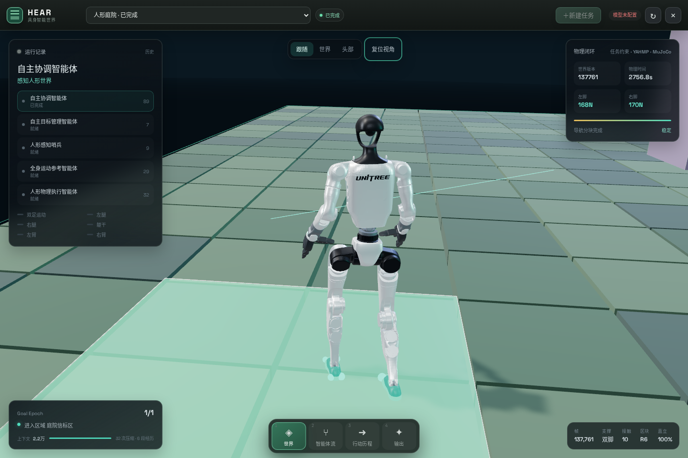
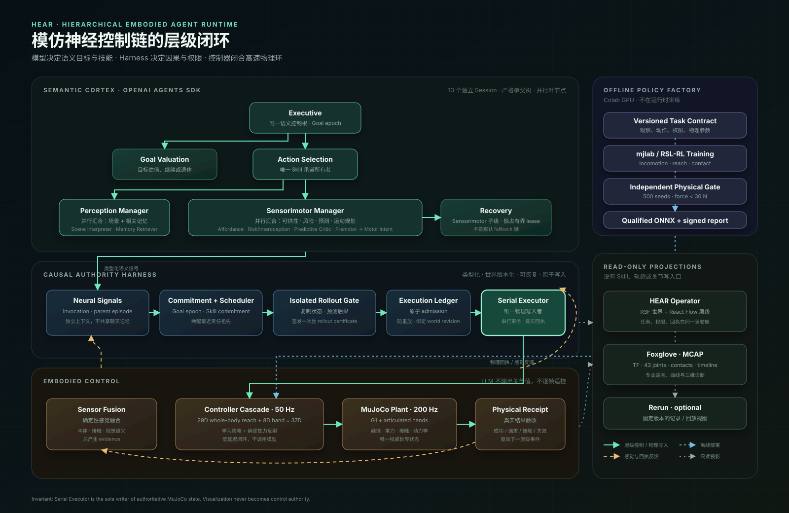
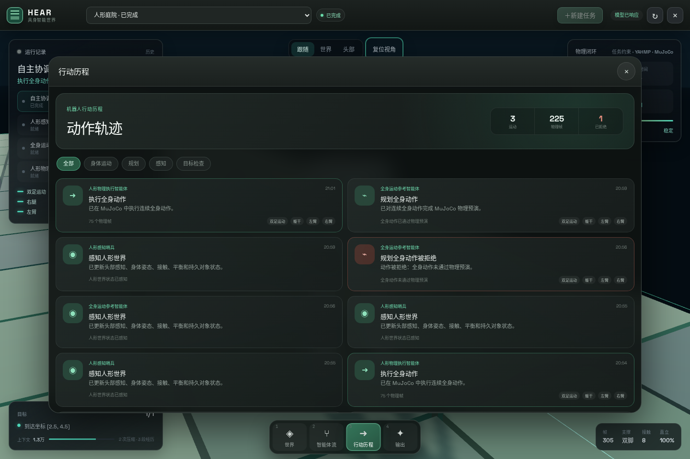
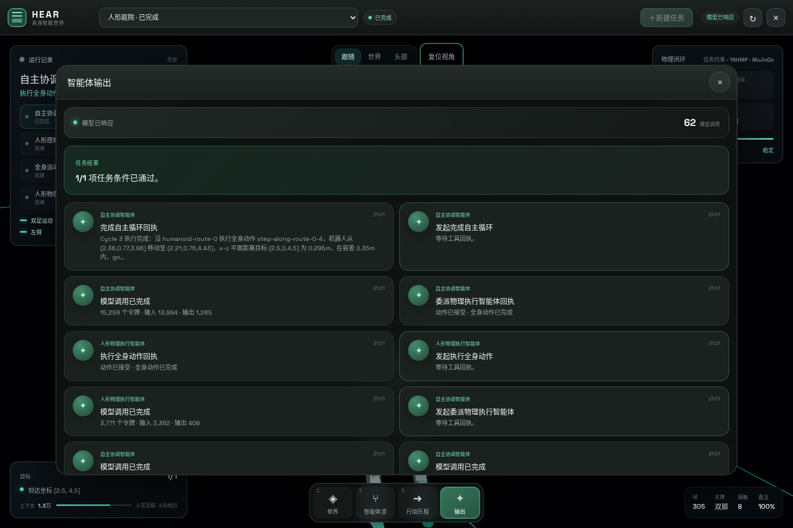

# HEAR

HEAR 是一个以**层级智能体 Harness**为核心、以学习式机器人控制为辅助的虚拟人形机器人系统。上层模型负责理解世界、选择目标、编排 Skill 和处理失败；Harness 负责控制权、因果信号、物理预演、执行准入和恢复；Unitree G1 在 MuJoCo 中由训练策略与确定性控制器共同驱动。

项目目标不是让模型逐帧遥控关节，而是让机器人在明确的物理和权限边界内持续感知、自主决策、自主运动，并从真实执行结果中闭环修正。



## 当前状态

HEAR 已具备可运行的层级 Agent Harness、MuJoCo G1 世界、训练/部署流水线和实时 Operator，但**尚未完成可靠的通用自由活动**。当前最明显的缺口是跌倒恢复和完整物体操作链。

| 子系统 | 当前结果 | 结论 |
|---|---:|---|
| 层级 Harness | 19 个结构节点；14 个模型 Agent，5 个确定性/控制/物理节点 | 主干已实现 |
| Workyard reach | 500 个独立环境，成功率 100% | 到达门禁通过 |
| 历史 contact/grasp | 500 回合，463 成功，成功率 92.6% | 仅证明接触/抓握；未授权 lift/carry/place，且未接受为当前部署策略 |
| G1 velocity | 1000 iterations，4096 个并行环境；独立评估平均平面位移约 7.33 m | 已形成有效移动策略 |
| G1 get-up | 500 回合，成功率 39.6% | 未通过部署门禁，未安装 |

这些数字只描述对应报告的验收范围。接触成功不等于机器人已经能完成“抓取—搬运—稳放”，训练 checkpoint 也不会因为存在于本地就自动获得运行权限。

## 完成度与瓶颈

以“操作者只给高层任务，机器人能够长期自主移动、跌倒后恢复，并完成多阶段物体操作”为完成标准，当前项目的**整体工程完成度约为 60%**。这是对可用能力和剩余风险的工程判断，不是按代码量、测试数量或页面数量计算。

| 模块 | 估计完成度 | 判断 |
|---|---:|---|
| 层级 Agent Harness | 78% | 19 节点控制树、独立 Session、类型化信号、commitment、rollout certificate 和唯一执行入口已形成；仍需证明长期连续任务中的重规划与恢复闭环 |
| MuJoCo 世界与执行运行时 | 75% | 权威世界、隔离预演、接触、检查点和恢复基础已完成；复杂接触和长时运行稳定性仍需加强 |
| 基础移动与平衡 | 70% | velocity 策略有效，导航和能力路由可用；跌倒后的重新站立尚不可靠 |
| 全身 reach | 70% | 独立门禁已通过；仍需与当前 contact 合同和连续操作链统一验收 |
| 接触与物体操作 | 35% | 历史 contact/grasp 局部门禁通过，但不兼容当前完整链路；lift、carry、place 尚未获得部署能力 |
| Recovery / get-up | 25% | 当前 39.6% 成功率远低于可靠运行要求，是自由活动的直接阻塞项 |
| 端到端持续自主运行 | 45% | 规划、预演和执行部件均存在，但跨 Goal、失败恢复和多阶段任务还没有形成稳定产品能力 |
| Operator 与可视化 | 65% | 3D 世界、层级流和运行信息可用；交互层级、视觉一致性和商业化完成度仍需收敛 |

当前瓶颈按优先级排序：

1. **P0 — 跌倒恢复没有过门禁。** 机器人一旦跌倒，39.6% 的 get-up 成功率无法支撑无人干预的自由活动。根因必须在起身策略、初始姿态覆盖、奖励与终止条件、动作权限和部署观察一致性上解决，不能依赖上层 Agent 重试掩盖。
2. **P0 — reach 与 contact 的策略合同尚未收敛。** 历史 contact/grasp 结果建立在旧 reach/observation 边界上，不能直接接入当前 whole-body reach。必须基于当前 observation、动作空间和权限分区重新训练并通过独立门禁。
3. **P0 — 完整操作链尚未成立。** 当前结果最多证明到达和局部接触/抓握；`grasp -> lift -> carry -> place` 仍缺少同一部署策略下的连续物理验收。只提高 contact 成功率不能解决这一问题。
4. **P1 — 长期 Agent 闭环尚未完成产品级验证。** Harness 的结构约束已经存在，但还需要在真实模型调用、世界变化、rollout 拒绝、执行偏离和进程恢复共同出现时，证明机器人能够自主上溯责任层并选择新 Skill，而不是停在失败循环中。
5. **P1 — 控制器切换仍是动态风险点。** 学习策略、参考控制和 Recovery 之间的交接必须在真实物理轨迹中保持平衡、接触和命令连续，不能只依靠能力声明判断可用性。
6. **P2 — Operator 仍需产品化收敛。** 界面已经能观察系统，但还需要减少信息噪声、突出任务/控制权/故障三条主线，并统一桌面与移动端的简洁视觉语言。

到达 100% 至少需要同时满足：

- 基础移动、转向、停止和跌倒恢复在独立留出环境中稳定通过门禁。
- 当前 whole-body 合同下的 reach、contact、grasp、lift、carry、place 完成连续部署验收。
- 操作者只提供任务目标，不需要逐帧、逐关节或逐 Skill 指挥机器人。
- 连续运行中能够处理 rollout 拒绝、碰撞、目标不可达、执行偏离和进程恢复，并继续形成新计划。
- Harness、控制器、训练产物和 Operator 使用同一套版本化能力合同，不依赖历史不兼容 checkpoint 或隐式回退冒充成功。

## 架构



HEAR 使用严格单父控制树，而不是共享对话和共享记忆的平级 Agent 群。除根节点外，每个节点只有一个直接父级；兄弟 Agent 拥有独立 Session，只能由共同父级调用和汇合。反馈可以沿白名单回路唤醒责任层，但不会产生第二个控制父级。

```text
Executive
├─ Goal Valuation
└─ Action Selection
   ├─ Perception Manager
   │  ├─ Sensor Fusion                 [确定性]
   │  ├─ Scene Interpreter
   │  └─ Memory Retriever
   └─ Sensorimotor Manager
      ├─ Affordance
      ├─ Risk / Interoception
      ├─ Predictive Critic
      ├─ Premotor
      │  └─ Motor Intent
      │     └─ MuJoCo Rollout Gate     [确定性]
      ├─ Certified Execution Dispatcher
      │  └─ Serial Executor            [唯一物理写入者]
      │     └─ Controller / Reflex
      │        └─ MuJoCo Body
      └─ Recovery
```

核心边界如下：

- 13 个推理 Agent 使用独立的 OpenAI Agents SDK Agent、Model facade 和持久 Session。
- Certified Execution Dispatcher 是第 14 个模型 Agent。它是纯执行节点，只能以 `tool_choice=required` 调用认证执行工具，并关闭思考。
- 其余推理节点默认保留思考，并使用 `tool_choice=auto`；“是否调用、调用什么”由节点职责和父级编排决定。
- Sensor Fusion、Rollout Gate、Serial Executor、Controller/Reflex 和 MuJoCo Body 是非模型节点。
- Action Selection 独占 Skill commitment 权限；Motor Intent 是最低认知规划边界。
- Serial Executor 是唯一能够修改权威 MuJoCo 状态的节点。
- 模型只提交语义目标与类型化参数，不直接输出逐控制帧电机动作。

一次动作只有在 Skill commitment、MuJoCo 独立预演、Predictive 接受、一次性执行证书和串行物理准入全部成立后才会改变世界。执行完成、偏离或失败的回执再沿原层级返回，驱动继续执行、重规划或 Recovery。

详细设计：

- [系统总览](docs/architecture/system-overview.md)
- [神经层级与控制协议](docs/architecture/neural-hierarchy-v3.md)
- [Agent Harness 设计](docs/architecture/agent-harness-v2.md)
- [可视化边界](docs/architecture/visualization-stack.md)

## 机器人控制与训练

层级 Agent 不直接控制 200 Hz 物理循环。机器人控制分为三个时间尺度：

1. Agent 层选择目标、Skill、对象、交互点和终止条件。
2. Harness 将语义动作求解为任务空间候选，在隔离的 MuJoCo 状态中预演并签发执行证书。
3. 学习策略与控制器在快速闭环中生成实际关节控制，MuJoCo 负责重力、碰撞和接触。

默认身体控制覆盖 29 个 G1 关节，并把运动能力划分为 locomotion、左右腿、躯干和左右臂。手部接触策略另有 8 维协同控制边界。运行时会根据策略声明、真实成功后验、入口状态分布和命令分布选择学习策略或参考控制；参考回退完成的任务不会被计为学习策略成功。

训练和部署是分离的：

```text
训练 -> 独立评估 -> 资格门禁 -> 导出 -> 安装 -> 运行时能力声明
```

只有通过对应门禁并被安装的策略才能获得运行时能力。当前 get-up 未通过门禁；历史 contact/grasp 结果也不能替代当前 whole-body reach 合同下的完整 contact、lift、carry 和 place 训练。

## 环境要求

| 组件 | 要求 |
|---|---|
| 操作系统 | Windows 10/11，或 Linux；Windows 上推荐 WSL2 处理 Linux 训练工具链 |
| Node.js | 22.13.0 或更高版本 |
| pnpm | 11.20.0 |
| 浏览器 | 支持 WebGPU 或 WebGL2 的现代浏览器 |
| 模型服务 | 支持流式响应和工具调用的 API |
| 本地 GPU | 非必需；大规模训练建议使用远程 GPU |

MuJoCo 和 ONNX 推理可在 CPU 上运行。训练脚本支持本地后端和 Colab 后端，长训练产物应写入持久目录或在会话结束前完成归档与校验。

## 安装

```sh
git clone https://github.com/multi-zhangyang/hear-3d-robot.git
cd hear-3d-robot
corepack enable
pnpm install --frozen-lockfile
```

创建本地配置：

Windows PowerShell：

```powershell
Copy-Item .env.example .env
```

Linux：

```sh
cp .env.example .env
```

## 模型配置

HEAR 优先使用 OpenAI-compatible Chat Completions，也保留 OpenAI Responses 和 Anthropic Messages 传输适配。项目不绑定具体服务商或模型。

在未被 Git 跟踪的 `.env` 中填写自己的配置：

```dotenv
AI_PROVIDER=openai_compatible
AI_BASE_URL=https://api.example.com/v1
AI_MODEL=your-model-id
AI_API_KEY=your-api-key

AI_REASONING_EFFORT=high
AI_TOOL_CHOICE=auto
AI_CONTEXT_WINDOW_TOKENS=262144
AI_REQUEST_TIMEOUT_MS=300000
AI_STREAM_EVENT_IDLE_TIMEOUT_MS=300000

HEAR_HOST=127.0.0.1
HEAR_PORT=8765
HEAR_RUNS_DIR=./runs
```

可以通过 `AI_AGENT_MODELS_JSON` 或 `AI_<PROFILE>_<SETTING>` 为结构节点覆盖模型。可用 profile：

| Profile | 职责 |
|---|---|
| `EXECUTIVE` | Executive、Goal Valuation、Action Selection |
| `ASSOCIATIVE` | Perception、Scene、Memory、Affordance、Risk |
| `SENSORIMOTOR` | Sensorimotor、Predictive、Premotor、Recovery |
| `MOTOR_INTENT` | 语义运动编译 |
| `COMPACTOR` | 单 Agent 历史压缩 |

每个 Agent 只维护自己的上下文。节点之间传递类型化信号、权威状态和工具结果，不传递其他 Agent 的对话历史、推理内容或压缩摘要。

完整变量列表见 [.env.example](.env.example)。

## 启动

开发模式：

```sh
pnpm dev
```

默认界面地址为 <http://127.0.0.1:8765>。

生产模式：

```sh
pnpm build
pnpm start
```

常用 CLI：

```sh
pnpm hear scenarios
pnpm hear run --scenario humanoid_courtyard --mission "探索环境" --goal '{"kind":"explore"}' --confirm
pnpm hear resume --run RUN_ID --confirm
pnpm hear benchmark --runs-dir runs
pnpm hear export-harness-rollouts --runs-dir runs
```

`mission` 在目标完成后结束；`continuous` 会在目标完成后继续自主选择下一目标，直到操作者暂停。升级 Agent 合同后，可在没有未完成物理事务时使用 `--fresh-agent-epoch` 创建新的 Agent epoch，同时保留世界、Goal DAG、动作账本和长期记忆。

## 训练与评估入口

训练合同检查：

```sh
pnpm validate:workyard-training
pnpm validate:workyard-residual-training
pnpm validate:workyard-contact-training
pnpm validate:workyard-observation-parity
```

移动与起身：

```sh
pnpm train:g1:colab
pnpm train:g1:getup:colab
pnpm evaluate:g1:getup:colab
pnpm qualify:g1:getup:runtime
```

Workyard reach/contact：

```sh
pnpm smoke:workyard:residual:colab
pnpm teacher:workyard:residual:colab
pnpm train:workyard:residual:colab
pnpm export:workyard:reach:colab
pnpm qualify:workyard:reach:deployment

pnpm teacher:workyard:contact:colab
pnpm pilot:workyard:contact:colab
pnpm train:workyard:contact:colab
pnpm export:workyard:contact:colab
pnpm install:workyard:policies
```

训练产物默认位于 `artifacts/training/`，不会进入 Git。远程训练必须在运行时结束前完成归档、字节数校验和 SHA-256 校验；需要跨会话保存时，应使用已配置的持久存储，而不是依赖临时运行时文件系统。

## 场景与界面

| 场景 | 内容 |
|---|---|
| `humanoid_courtyard` | 固定庭院、障碍、低台和目标信标 |
| `humanoid_workyard` | 可操作装配件、承托台、通道和稳放区域 |
| `humanoid_cabinet` | 铰链柜门、遮挡工件和目标容器 |
| `humanoid_frontier` | 随机障碍与可动物体组成的程序化空间 |
| `humanoid_realm` | 更大的程序化世界与多个区域 |

Operator 使用 React Three Fiber 展示 G1 和权威世界，React Flow 展示实时 19 节点控制树，并提供身体状态、动作回执、模型活动和物理状态。Foxglove MCAP 导出用于只读分析，不具备命令通道。

| 行动历程 | 智能体输出 |
|---|---|
|  |  |

## 数据与恢复

每个运行保存在 `${HEAR_RUNS_DIR}/<run-id>/`，默认是 `runs/<run-id>/`：

| 文件 | 内容 |
|---|---|
| `run.json` | 任务、场景、目标与控制器来源身份 |
| `checkpoint.json` | 层级、世界、物理和记忆检查点 |
| `agent-state.json` | 可恢复的 Agents SDK 状态 |
| `sessions/` | 各 Agent 的独立 Session |
| `agent-manifest.json` | Agent、工具、Schema 和 SDK 身份；不含凭证 |
| `actions.jsonl` | 规划与执行回执 |
| `events.jsonl` | 实时与恢复事件 |
| `episodes.jsonl` | 长期具身经历 |
| `model_calls.jsonl` | 模型调用状态与计量 |
| `goal_history.jsonl` | Goal 决策和结果的哈希链历史 |

恢复时会核验层级合同、模型配置身份、工具 Schema、控制器和策略资产。发生不兼容变化时会明确拒绝恢复，不会静默复用旧 Session 或切换控制器。

## 项目结构

```text
src/harness/humanoid/  层级 Agent、控制权、工具和动作回执
src/world/humanoid/    G1、MuJoCo、运动求解、接触与世界模型
src/controllers/       学习策略适配、能力路由和参考控制器
src/runtime/           运行生命周期、上下文和 Goal 检查
src/model/             模型协议与 Agents SDK 适配
src/persistence/       检查点、日志和 Session
src/server/            Operator API、SSE 和运行管理
training/              GPU 训练、评估、导出和安装工具
web/src/               3D Operator 与层级可视化
docs/architecture/     系统、Harness 和可视化设计文档
```

## 安全与隐私

- `.env`、运行数据、训练产物和构建产物不进入 Git。
- API 凭证只从服务端环境变量读取，不进入浏览器配置、运行清单或文档。
- README、示例和默认配置只使用占位符，不保存个人账号、邮箱、真实私有端点、云盘路径或本机绝对路径。
- Operator 默认只监听 `127.0.0.1`。绑定非回环地址时必须配置访问密码和外部访问控制。
- 运行日志可能包含模型输出与世界状态，应按实际部署的数据策略保存。

## License

[MIT](LICENSE)
