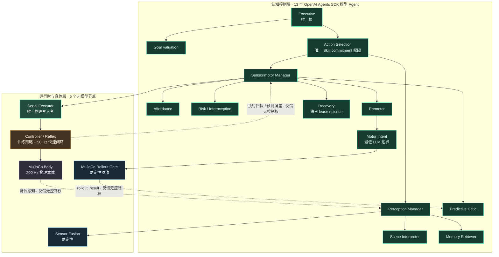
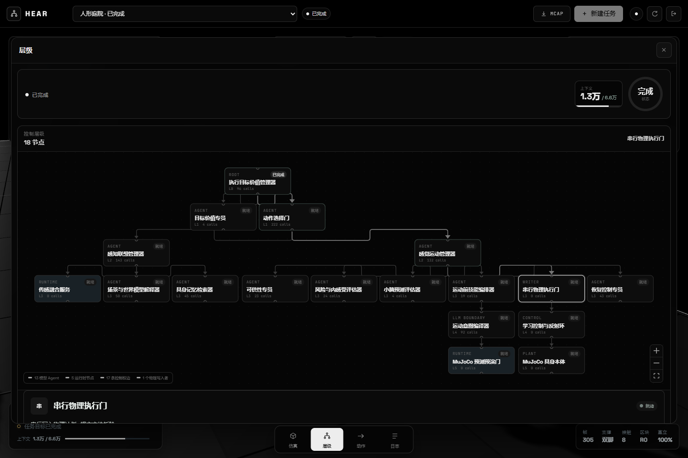
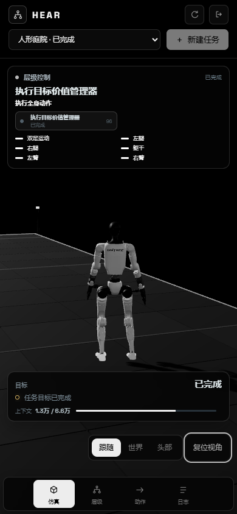

# HEAR

[](https://github.com/multi-zhangyang/hear-3d-robot/actions/workflows/ci.yml)

HEAR 是一个由层级智能体自主驱动的虚拟 3D 人形机器人运行时。模型负责观察、选择目标和提出任务空间动作；Harness 负责权限、计划来源、物理预演、执行回执和目标验收；Unitree G1 模型在 MuJoCo 中通过全身控制器完成实际运动。


## 核心能力

- 神经启发式层级 Agent Harness：18 个结构节点组成严格单父控制树，其中 13 个 OpenAI Agents SDK 模型 Agent 各自拥有独立 Model 与持久 Session，5 个低层节点是确定性服务、控制器或物理本体
- 遮挡感知的持久空间信念、未知区域 frontier、对象中心世界模型、可供性目录与模型提交的 Skill DAG
- G1 29 个全身关节与 14 个手部关节、双足接触、质心、支撑面和跌倒检测
- 模型选择 Goal、Skill、对象、手、交互点和策略；通用求解层自动生成可达站位与任务空间轨迹
- 任务可约束左/右手腕或脚踝的世界或骨盆相对三维位姿，并要求位置、朝向在连续物理帧内稳定成立
- 双手掌指接触、抓取稳定、携带绑定、主动释放与支撑面稳放提供真实物理验收，不以坐标吸附替代策略能力
- 每个几何候选从同一 MuJoCo 状态独立预演，只执行首个满足物理约束与 Skill 终止条件的候选
- 全身 Option 使用受限物理条件树和前置、持续、终止三个阶段，成功必须经过连续帧稳定验收
- 预演轨迹与运动制品分别进行 SHA-256 校验；真实执行持续偏离预演时立即截断并重新规划
- 预演与真实执行分别累计支撑余量、足底滑移、关节余量、速度、接触冲击和执行器力矩证据
- 默认 mjlab G1 学习策略在 50 Hz 执行平衡和移动，YAHMP 在需要关节参考跟踪时接管对应控制步，MuJoCo 在 200 Hz 处理重力、力矩、碰撞与接触
- Recast 导航网格和分段物理预演，不通过修改根节点坐标伪造移动
- 导航预演与执行遇到阻塞时返回真实接触部位、实体、接触点、法向和法向力；模型可选择替代路线或全身净空姿态
- 可见方块可通过接近、稳定掌指接触、执行授权和原子世界事务完成通用拆除
- 程序化方块世界，世界种子、障碍、物体和目标区域按任务生成
- 头部视场感知与角色化 3D 对象状态，当前 MuJoCo 精确状态和历史观察严格分离
- 追加式事件日志、可寻址具身历史、物理检查点、独立会话和结构化上下文压缩
- 中文实时界面，展示 3D 世界、层级执行流、动作回执、模型活动与物理状态
- React Three Fiber + Drei 声明式管理 Three.js 舞台，优先使用 WebGPU 并自动回落 WebGL2
- React Flow + d3-hierarchy 显示可缩放的 18 节点严格单父控制权树
- 一键导出 Foxglove MCAP：包含运行事件、权威世界、43 关节、坐标变换、接触/质心和导航线，且没有命令通道
- Windows 与 Linux/WSL 开发运行；训练任务通过 Colab GPU 执行

## 运行链路


图中的绿色实线是层级控制和物理写入，黄色虚线是感觉与回执反馈，蓝色虚线是通过独立 gate 后的离线策略部署，灰色虚线是只读可视化。只有 Serial Executor 能够写入权威 MuJoCo 状态；Foxglove、Rerun 和 Operator 都不是控制节点。完整说明见 [System Architecture](docs/architecture/system-overview.md)。

```text
Executive
├─ Goal Valuation
└─ Action Selection
   ├─ Perception Manager
   │  ├─ Sensor Fusion（确定性）
   │  ├─ Scene Interpreter
   │  └─ Memory Retriever
   └─ Sensorimotor Manager
      ├─ Affordance
      ├─ Risk / Interoception
      ├─ Predictive Critic
      ├─ Premotor
      │  └─ Motor Intent（最低 LLM 边界）
      │     └─ MuJoCo Rollout Gate（确定性）
      ├─ Serial Executor（唯一物理写入者）
      │  └─ Controller / Reflex（训练策略 + 快速闭环）
      │     └─ MuJoCo Body
      └─ Recovery（父级签发的独占 authority lease episode）
```



上图的 **17 条实线**只表示控制权所有权；三条虚线只概括带因果来源的闭环反馈。Rollout、身体感知、预测误差和执行回执都不是第二父级，也不会把树改成平级 Agent 网络。



这是控制权树，不是平级多 Agent 网络。除 Executive 外，每个节点只有一个直接父级；父级通常通过 `Agent.asTool()` 调用模型子级并保留控制权。兄弟节点不互相通信、不共享 Session，只允许由共同父级发起并汇合两组只读并行：Scene + Memory、Affordance + Risk。每次直接子级调用都有独立 `invocation_id`，并绑定共同父级的 `parent_episode_id`；共同父级只能汇合属于自己本次 episode 的返回，禁止依靠队列顺序、payload 相等或“第一个 pending 信号”猜测配对。父子委派没有自由文本 `intent` 通道：父级只能选择自己拥有的子边和当前父 episode 真正拥有的 pending `source_signal_ids`；允许多种信号的边仍受合同约束，而当前相位只有一种合法输入的边会把 `signal_kind` 收窄为单一 schema 字面值。旧 episode、兄弟、其他父级、已消费或过期信号即使 UUID 仍在历史中也会被代码拒绝。反馈信号可以沿白名单回路唤醒最近责任层，但不会生成第二父级。

Perception Manager 不再把整份 Sensor Fusion、Scene 和 Memory 文档重新生成一遍；它只提交有界的 `compact_perceptual_belief_v1`。Harness 在校验后依据本次 Manager episode 的三个直接子信号物化完整知觉证据，再沿唯一父边上送。这让模型负责状态估计、Harness 负责无损证据运输，避免长几何数组把函数调用 JSON 截断，同时不会替模型选择 Skill、手、交互点、路线或姿态。

Action Selection 使用两阶段技能协议：Sensorimotor 第一次只能返回
`skill_proposal`；Action Selection 独占建立一个与 Goal epoch、世界版本和
终止条件绑定的 durable commitment，然后用新的父子 authority lease 再次下发。
真实 MuJoCo rollout 被 Predictive 显式以 `accepted=true` 接受后，Harness 才会
签发一次性、载荷哈希绑定的 rollout certificate；仍只有 Action Selection 能把
同一 commitment 转为 `executing`。Serial Executor 在此之前不可见。certificate
的消费与 physical execution ledger 准入在同一个持久提交点完成，崩溃恢复也只
允许同一个 transaction 继续。执行结果沿原树逐层返回，完成或失败也只能由
Action Selection 根据真实回执解析 commitment。

事件 Scheduler 不是 Agent、不是 Manager，也不是第二根。它只把世界变化、
rollout、执行反馈和预测误差解析为“期望责任层”，再沿单父树上溯到最近仍有
有效 lease 的责任祖先，并把唤醒计划交给唯一 Executive。真正的子 Agent
episode 仍只能由其直接父级通过 `Agent.asTool()` 打开。

Recovery 也没有第二父级，更不是 SDK handoff。Sensorimotor Manager 冻结
普通分支后，以独占 lease 启动一个上下文隔离的 Recovery episode；它只能返回
恢复提案或升级，lease 关闭后控制仍回到同一个 Sensorimotor 父级。

Motor Intent 的局部恢复按控制模态封顶，而不是靠增加重试次数：同一
`transit_clearance` episode 可自主尝试 whole-body clearance 和 alternate
navigation；两种模态都被真实 Rollout Gate 拒绝后，Harness 将两条因果信号合并为
typed escalation，沿 Premotor 逐级上送。Action Selection 随后关闭已被证伪的
commitment，再让独占 Recovery 选择新 Skill，避免在旧承诺内无限改坐标。

控制树、反馈图和执行状态机的完整定义见 [`docs/architecture/neural-hierarchy-v3.md`](docs/architecture/neural-hierarchy-v3.md)。模型认知在 Motor Intent 截止；规划求解、MuJoCo 预演、唯一串行执行、训练策略和控制器闭环都位于其下。Harness 按事件唤醒路径，并在代码层强制“感知 → 父级并行汇合 → 技能 → rollout → 预测评估 → 串行执行 → 反馈”，不依赖模型按提示词自行维持安全顺序。

认知层、权限 Harness、离线训练、快速控制闭环与可视化之间的完整边界见 [`docs/architecture/system-overview.md`](docs/architecture/system-overview.md)。

层级协议升级不会静默复用旧 Agent Session。普通 resume 会明确拒绝旧 neural contract；显式 `hear resume --run RUN_ID --fresh-agent-epoch --confirm` 会在没有未完成物理事务或 action commit 时归档旧 Manifest、RunState 与各节点 Session，重建 neural hierarchy/context epoch，同时原样保留物理世界、Goal DAG、已提交动作账本和 embodied memory。若机器人仍处于 admitted/executing transaction，该切换会拒绝执行，必须先恢复同一物理事务。

一次动作需要同时满足以下条件才会改变世界：

1. 工具参数通过严格 schema 校验。
2. 规划回执属于正确智能体和当前世界版本。
3. Skill、对象、手、交互点与策略来自当前运动智能体的真实模型响应。
4. 通用求解器至少生成一个与该语义身份一致的可达任务空间候选。
5. 被选候选的完整 MuJoCo 预演没有跌倒、非法接触、持续条件违规或缺失的必需接触。
6. Predictive 对该精确 rollout 显式接受，并由 Harness 签发绑定 Goal、commitment、规划事务、rollout/Predictive invocation、两个因果信号与 payload SHA-256 的一次性 certificate。
7. certificate 消费与 Serial Executor 的 durable physical admission 原子提交；同一证书不能驱动第二个物理事务。
8. 真实执行逐帧满足物理 Option；目标稳定达成后立即停止，持续偏离预演或违反条件时立即交回重规划。

自主差异来自模型对实时观察、空间 frontier、对象可供性、目标和历史回执的决策，以及每次任务独立生成的世界。程序不会从预设动作表挑选行为，也不会用随机电机噪声代替自主决策。Harness 只把模型选定的语义 Skill 求解为物理候选，不会改换目标、对象、手或策略。

## 机器人与世界

默认机器人使用 Unitree G1 模型，身体控制按六个通道组织：

| 通道 | 范围 |
|---|---|
| `locomotion` | 根速度、朝向与神经双足步态 |
| `left_leg` | 左腿运动链与左脚踝末端目标 |
| `right_leg` | 右腿运动链与右脚踝末端目标 |
| `torso` | 腰部与躯干姿态 |
| `left_arm` | 左臂和左手末端 |
| `right_arm` | 右臂和右手末端 |

标准运动链只接收语义 Skill。模型决定探索 frontier、操作对象、交互点、左右手和策略，求解层再从当前腕部碰撞面、对象尺寸、关节轴、铰链锚点、持物绑定和根姿态计算站位与末端目标。多末端 SE(3) 阻尼最小二乘逆运动学生成连续腿臂参考，学习式全身控制器生成实际关节控制。接近、伸手、抓取、抬升、搬运、放置、推拉、按压、开合、换手、双手支撑、稳定、撤退和方块交互使用同一套 Skill 约束表达；当前控制器无法完成的候选会被物理预演拒绝，不会由场景专用动作或成功回执补齐。

每个预演证书与真实执行回执分别记录动态安全证据。证据来自对应的实际物理帧，包括支撑凸包余量、足底切向滑移、关节极限余量、关节速度、峰值接触力、法向力上升率，以及执行器请求与实际力矩、利用率和饱和状态；缺失的观测保持缺失，不会合成默认数值。恢复后的证据只覆盖真正执行过的轨迹前缀。

默认生成器是确定性的任务约束求解器，自主性来自上层模型选择的目标、Skill 和策略，不来自固定动作表。`humanoid-motion-generator-v1` 协议允许接入学习式生成器；生成器类型、采样方式和实现身份会进入实时世界状态与检查点，恢复时必须与原运行一致，不会静默切换后端。

### 运动策略与训练接入

层级智能体不直接输出电机值或关节动作。它负责语义目标、Skill DAG、交互对象和终止条件；低层运动由 [`HumanoidWholeBodyController`](src/world/humanoid/whole-body-controller.ts) 执行。`HumanoidWorld.create` 的 `controllerFactory` 会分别为权威 MuJoCo 世界和独立预演池创建控制器实例，场景资源重建时继续使用同一工厂。控制器状态必须支持捕获与恢复，策略的观察空间、动作空间和真实能力随世界快照公开。

不设置 `HEAR_HUMANOID_CONTROLLER_MODULE` 时，正式 CLI 和 Operator 默认加载仓库随附的 Workyard 全身 reach 控制器：mjlab G1 策略提供运动参考，29D reach 策略联合修正平衡关节并控制双臂。只有通过新 reach 合同重新训练和资格验证的 contact 策略，才可通过 `hear/controllers/workyard-contact` 显式叠加 8D 手部协同并声明接触式操作能力；系统不会把旧 contact 模型接到不兼容的观测空间。设置该变量可以覆盖默认控制器；值可以是相对路径、绝对路径或已安装包名。模块必须导出 `createHumanoidWholeBodyController(context)`，并在每次调用时创建独立的 [`HumanoidWholeBodyController`](src/world/humanoid/whole-body-controller.ts) 实例。模块可以通过 `humanoidControllerAssets` 声明 ONNX、训练报告等本地策略文件，运行来源身份会同时覆盖入口与全部资产内容。运行定义不保存本机路径；恢复时入口或任一策略资产发生变化都会在创建世界前被拒绝。未记录来源身份的历史运行仍使用创建时的 YAHMP，不会被新的默认策略静默迁移。

YAHMP 参考控制器声明 `balance`、`locomotion` 和 `joint_reference_tracking`。任务空间 IK、接触柔顺和抓取检查器是参考生成与物理验收组件，不代表策略已经学会接触式操作或双手操作。后续可以接入强化学习、模仿学习或其他已训练策略；新控制器只有在真实支持时才应声明 `contact_rich_manipulation` 或 `bimanual_manipulation`，Harness 仍会用同一 MuJoCo 预演和执行回执验证结果。只运行参考控制器时可设置 `HEAR_HUMANOID_CONTROLLER_MODULE=hear/controllers/yahmp`。

运行创建和恢复会在首个模型调用前检查 Goal 与控制器的永久能力边界。抓取、搬运、稳放、容器和关节操作目标若没有已安装且明确声明 `contact_rich_manipulation` 的训练策略，会立即拒绝启动；系统不会让 Agent 在物理上不可能的 Goal 上循环，也不会用参考控制或扩大容差冒充接触策略。

外接学习策略缺少平衡、移动或关节参考跟踪中的任一基础能力时，模拟器会把它作为主控制器，并创建独立 YAHMP 参考控制器组成能力路由。声明能力只是第一层筛选；路由还按控制器实现与语义 Skill 家族保存真实成功后验、近期结果、成功入口状态分布、命令分布和策略切换结果。冷启动允许有界探索，积累足够真实终态后，低置信成功后验、入口状态 OOD 或命令 OOD 都会拒绝学习策略并使用参考回退。预演不会写入能力经验，未完成准入与能力证据会随物理检查点精确恢复。

站立、普通导航、持物导航和全身运动的每个控制步都会声明实际能力需求与任务目标。分支切换不会直接跳变电机目标，而是按控制器声明的响应周期连续插值关节目标、刚度和阻尼。终态归因分别统计主策略、完整回退和上身叠加控制步；只有回退接管后才完成的任务不会被伪记为学习策略成功。准入理由、置信区间、OOD 分数、控制段归因与切换结果进入物理轨迹、执行回执和 benchmark。主策略的 `learnedPolicy.capabilities` 保持原值，参考控制不会被合并或冒充为训练能力。已经完整实现能力路由的外接控制器可以通过 `capabilityRouting` 描述自身边界，运行时不会再次包装。

控制器协议同时提供可声明的策略观察特征与逐控制步任务命令。训练策略可按自身编码消费根运动、手部状态、末端状态、MuJoCo 接触、对象与关节状态，以及当前任务空间目标和抓取约束；YAHMP 仍只读取原有本体状态与命令历史。语义 Skill 不会被展开成模型供应商或训练框架专用格式，因此本地 ONNX、远程策略服务和后续训练产物可以共用同一控制器边界。

统一 Skill 合约逐阶段声明完成学习式执行所需的策略能力，实时目录会分别公开当前环境可用性与已训练能力覆盖。未被当前策略覆盖的阶段会明确标记为参考控制回退，不能被描述为已经训练完成。控制器收到的任务命令同时包含能力要求、任务空间目标、抓取约束和可观测物理终止谓词，训练侧不需要读取 Agent 提示词或依赖模型供应商格式。

仓库随附一个由 mjlab 1.5.3 训练的 G1 速度策略及其训练报告，并将它作为新运行的默认主策略。标准控制器严格校验报告版本、ONNX SHA-256、张量形状、29 关节顺序、控制周期和策略元数据，使用 MuJoCo 骨盆 IMU 坐标下的 99 维真实观察推理。它只声明并输出训练得到的 `balance` 与 `locomotion` 动作，不在策略输出中混入未训练的任务关节控制；这类任务由上述独立能力路由执行。

仓库同时提供基于 [mjlab](https://github.com/mujocolab/mjlab) 与 RSL-RL 的 G1 速度策略训练入口。训练直接使用 mjlab 的正式 `Mjlab-Velocity-Flat-Unitree-G1` 环境和 MuJoCo Warp，不在仓库内另写一套强化学习算法。已登录 Colab CLI 后可启动 GPU 训练：

```sh
pnpm train:g1:colab -- --gpu H100 --iterations 1000 --num-envs 4096
```

命令会创建独立 Colab 会话，训练真实 PPO checkpoint，由 mjlab 导出带控制元数据的 ONNX，并在 GPU MuJoCo 环境中执行无界面策略评估。checkpoint、ONNX、环境配置、评估指标和 SHA-256 报告下载到 `artifacts/training/`，同时解包为可直接运行的策略目录。将 `HEAR_MJLAB_G1_POLICY_DIRECTORY` 指向该目录即可替换随附策略；训练、下载、解包或校验失败都会直接返回错误，不生成替代策略。结束或失败后 Colab 会话都会释放。

程序化场景生成开阔区域、方块障碍、可动物体和目标区域。头部相机以真实水平与垂直视场持续更新 0.5 米空间信念网格；可见物理几何会截断其后的地面射线，墙后区域保持未知，移动或拆除实体留下的占据只有在重新进入视野后才会清除。模型从这种未知区域边界选择探索目标。Recast 根据当前静态与动态几何生成导航路径，每段路线都先在当前物理状态副本中完整执行。Premotor 与 Motor Intent 一次选择并绑定完整语义 Skill；Serial Executor 一次准入后，确定性 navigation horizon 会连续消费多个有界路线段，并在每段真实终态重新观察、重规划和预演，直到阶段后置条件满足、真实阻塞、安全失败、取消或有限执行 horizon 耗尽，模型不再逐段调用“下一步”。单段执行中出现新的几何阻塞时，执行监控层保持原 Skill 目标并从真实终态重新规划，最多进行两次有界尝试。预演碰撞会携带 MuJoCo 接触面、静态或动态实体身份、接触点、法向和法向力，模型据此选择替代路线或全身净空姿态。跌倒、物体滑脱或语义前提失效不会被低层重规划掩盖，而是通过 Risk / Prediction 信号进入有界 Recovery authority lease。

可动物体的抓取不是吸附或坐标绑定。系统从当前掌指接触面、接触力、对向接触、离开支撑面的高度、手物相对位姿稳定性和连续抬升帧建立抓取证据；只有通过证据的手物关系才能进入携带状态。持物导航逐帧验证抓取延续和未授权碰撞，放置动作必须由模型产生张手与撤手运动，并同时满足物体进入目标区域、手部脱离和非人形支撑面稳定承托。

## 长期运行

十三个模型节点分别拥有独立的 Agents SDK Session 和 Model facade；Sensor Fusion、Rollout Gate、Serial Executor、Controller / Reflex 与 MuJoCo Body 不创建模型 Session。稳定指令和各节点自己的历史位于请求前缀，实时世界权限与定向神经信号位于末尾；缓存亲和键按凭证、协议、模型和结构 Agent ID 保持稳定。亲和键只影响供应商缓存路由，不承载对话内容；不同 Agent、不同 Run 的 Session 和物理状态始终隔离，父子间只交换有世界版本、TTL 和因果来源的类型化信号。

每个 Agent 的上下文只压缩自己的历史，不接收兄弟或父子 Agent 的压缩摘要。完整事件、模型生命周期、动作、具身经历、检查器和上下文记录继续保存在追加式日志中。Goal DAG 与可寻址具身记忆仍是长期事实来源；历史召回只能由 Memory Retriever 进行有界查询，再经 Perception Manager 汇合为上行证据，不能作为跨 Agent 共享上下文或替代当前 Sensor Fusion。结构 Agent、其 Session、工具 Schema、输出 Schema、控制边、反馈合同和运行时服务身份全部写入 V3 Agent Manifest，恢复时不允许旧 Coordinator epoch 静默复用新层级 Session。

上下文压缩本身由独立模型完成。无效输出可以在同一压缩回合内重新生成；网络中断会立即交还原业务 Agent 的标准传输恢复流程，原始历史和 Session 不会被替代摘要覆盖。只有通过 schema、来源引用和当前世界权限校验的压缩记录才会成为新基线；基线提交后的业务请求若中断，恢复只保留该基线和真实热历史，不会重新灌入已经裁剪的旧前缀。配置窗口不足属于明确的容量错误，不会无限重试。

运行时按权威世界版本、真实物理帧和动作回执检测长期无进展循环。守卫只中断并重建停滞的模型上下文，不生成默认动作，也不替模型选择行为。目标稳定进度随检查点持久化；恢复时只接受与 Goal 哈希、世界快照和 MuJoCo 检查点一致的证据。

模型传输中断时，可序列化的 Agents SDK RunState 只在 Goal、动作账本、上下文压缩、神经 hierarchy epoch 和自主循环身份仍兼容时继续使用。每份 RunState 绑定其实际涉及的结构 Agent Session 精确历史前缀；恢复会先核验这些前缀，再移除断线后未形成新状态的会话后缀。任一前缀分歧都会拒绝该 RunState，已经提交的物理动作、Goal 证据和追加式日志不会回滚。OpenAI-compatible 传输还会在请求边界清理进程中断留下的半边工具协议片段，完整工具调用与结果保持原顺序，动作事实继续由当前 Harness 权威块提供。

运行检查点包含：

- 层级节点、活动智能体、模型调用计数和 provider 返回的逐智能体 token 用量
- MuJoCo 状态、控制器历史和当前全身参考
- 世界版本、导航计划、物体记忆与任务检查结果
- 具名末端目标的逐帧稳定进度与 Goal 身份校验
- 已提交动作回执、候选筛选证据和待处理生命周期事件
- 不可变运动制品、物理预演轨迹、Option 监控状态与执行游标
- 十三个模型智能体的独立 Session、五个非模型节点身份、控制树、反馈合同、authority lease 与可恢复 SDK 状态

Operator 异常退出后，未完成任务会转为可恢复状态。恢复操作从持久化物理状态和上下文继续，不播放录制动画。尚未完成的物理动作使用原 transaction ID 和原规划制品续接，完成后才恢复上层模型循环；正常暂停会把不足周期的执行尾帧一并写入账本。旧检查点若已保存更靠后的精确 MuJoCo 状态，只在规划进度与世界版本完全一致时从该状态继续，无法重建的中间轨迹明确标记为不完整。有限任务的最终 Goal 验收、Run 成功状态和生命周期事件在同一检查点事务中提交，恢复后不会继续创建多余 Goal。

## Web 界面

3D 世界始终保持在主视图。界面从当前运行的 hierarchy contract 动态显示 18 节点控制树，而不是写死旧版角色数量；同时提供跟随、世界和头部三个观察视角，并实时显示：

- 当前活动节点与 18 节点单父层级
- 身体通道活动状态
- 世界版本、物理时间、双脚法向力、支撑和直立度
- 当前实际执行的学习或参考控制器，以及连续交接进度
- 任务谓词与上下文占用
- 归档 Goal 的终身完成结果
- 具名末端目标的实时稳定帧进度
- 规划、执行和拒绝回执
- 碰撞部位、场景实体与实时恢复状态
- 经过整理的模型活动与输出

产品主舞台采用 React Three Fiber + Drei，层级图采用 React Flow。每个运行现可从顶栏导出自包含的 Foxglove MCAP，用现成的 3D、时间轴和曲线面板分析权威世界与物理状态；后续实时 WebSocket 仍只会是只读投影。Rerun 被定位为版本固定的记录/回放面；二者都不会替代 HEAR 的任务与 Harness 权限界面。完整选型和集成边界见 [Visualization Stack](docs/architecture/visualization-stack.md)。

| 行动历程 | 智能体输出 |
|---|---|
|  |  |



## 环境要求

| 组件 | 要求 |
|---|---|
| 操作系统 | Linux、Windows 或 macOS |
| Node.js | 22.13.0 或更高版本 |
| 包管理器 | pnpm 11（建议通过 Corepack 启用） |
| 浏览器 | 支持 WebGPU 或 WebGL2 的现代浏览器 |
| 模型服务 | 支持流式响应和工具调用的 API |

默认 MuJoCo 和 ONNX 后端可以在 CPU 上运行，不要求 GPU。实际速度取决于处理器、所选模型服务和场景规模。

## 安装

```sh
git clone https://github.com/multi-zhangyang/hear-3d-robot.git
cd hear-3d-robot
corepack enable
pnpm install --frozen-lockfile
```

Linux 与 macOS：

```sh
cp .env.example .env
```

Windows PowerShell：

```powershell
Copy-Item .env.example .env
```

## 配置

HEAR 不绑定特定模型或服务商。传输协议、地址、模型和凭证均由环境变量提供。

```dotenv
AI_PROVIDER=openai_compatible
AI_BASE_URL=https://api.example.com/v1
AI_MODEL=your-model-id
AI_API_KEY=your-api-key
AI_REQUEST_TIMEOUT_MS=300000
AI_STREAM_EVENT_IDLE_TIMEOUT_MS=300000

AI_TEMPERATURE=0.2
AI_REASONING_EFFORT=
AI_TOOL_CHOICE=auto
AI_MAX_OUTPUT_TOKENS=
AI_CONTEXT_WINDOW_TOKENS=262144
AI_COMPACT_TRIGGER_TOKENS=
AI_COMPACT_RECENT_MODEL_TURNS=4
AI_COMPACT_MAX_OUTPUT_TOKENS=

HEAR_HOST=127.0.0.1
HEAR_PORT=8765
HEAR_OPERATOR_PASSWORD=
HEAR_RUNS_DIR=./runs
HEAR_DENSE_POLICY_ROLLOUT_DIR=./artifacts/training/harness-rollouts/dense
HEAR_HUMANOID_CONTROLLER_MODULE=
HEAR_MJLAB_G1_POLICY_DIRECTORY=
HEAR_WORKYARD_REACH_POLICY_DIRECTORY=
HEAR_WORKYARD_CONTACT_POLICY_DIRECTORY=
HEAR_WORKYARD_CONTACT_TARGET_ZONE_ID=assembly_bay
```

可用传输协议：

| `AI_PROVIDER` | 协议 |
|---|---|
| `openai_compatible` | OpenAI-compatible Chat Completions |
| `openai_responses` | OpenAI Responses API |
| `anthropic_messages` | Anthropic Messages API |

`AI_CONTEXT_WINDOW_TOKENS` 应填写模型实际上下文上限，默认值为 `262144`。`AI_REASONING_EFFORT` 可按模型能力设置为 `none`、`minimal`、`low`、`medium`、`high`、`xhigh` 或 `max`，留空则不发送该参数。`AI_TOOL_CHOICE` 支持 `required` 和 `auto`，默认值为 `auto`；`none` 会在启动前被拒绝。各 reasoning Agent 拥有独立 Session 和独立上下文预算；Manager 调用专家时只接收有界 delegation result，专家完整历史不会并入 Manager Session。节点间只传类型化信号、当前权威状态和正式工具结果，不传另一节点的 reasoning、对话历史或压缩摘要。`AI_MAX_OUTPUT_TOKENS` 与 `AI_COMPACT_MAX_OUTPUT_TOKENS` 默认留空，运行时不会向模型请求发送输出上限；压缩阈值留空时按各 Agent 的实际窗口减去输出预留计算，且仅总结该 Agent 自己的旧历史。不依赖 Responses 专属的 opaque compaction item。

`AI_REQUEST_TIMEOUT_MS` 默认是 `300000`，表示 HTTP 建连或相邻响应数据之间允许的最长静默时间。`AI_STREAM_EVENT_IDLE_TIMEOUT_MS` 默认同为 `300000`，约束相邻 Agents SDK 模型事件之间的静默时间；只有真实模型事件会续期。两者均可按端点能力在 5 秒至 10 分钟之间调整，任务总时限、人工停止和进程恢复仍独立生效。

模型节点按四个可独立配置的结构 profile 选择供应商参数；未设置的 profile 变量继承同名 `AI_*` 默认值。旧 `GOAL_MANAGER`、`COORDINATOR`、`MOTION`、`SENTRY` 与 `EXECUTOR` 键只用于读取 V1 运行或兼容旧部署，不再表示 V3 的结构身份：

| `PROFILE` | V3 结构职责 |
|---|---|
| `EXECUTIVE` | Executive、Goal Valuation、Action Selection |
| `ASSOCIATIVE` | Perception、Scene、Memory、Affordance、Risk |
| `SENSORIMOTOR` | Sensorimotor、Predictive、Premotor、Recovery |
| `MOTOR_INTENT` | 最低模型层的语义运动编译 |
| `COMPACTOR` | 长期上下文压缩 |

`SETTING` 支持 `PROVIDER`、`BASE_URL`、`MODEL`、`API_KEY`、`REQUEST_TIMEOUT_MS`、`STREAM_EVENT_IDLE_TIMEOUT_MS`、`TEMPERATURE`、`REASONING_EFFORT`、`TOOL_CHOICE`、`MAX_OUTPUT_TOKENS`、`CONTEXT_WINDOW_TOKENS`、`COMPACT_TRIGGER_TOKENS`、`COMPACT_RECENT_MODEL_TURNS` 和 `COMPACT_MAX_OUTPUT_TOKENS`。例如 `AI_MOTOR_INTENT_MODEL` 只覆盖 Motor Intent profile；`AI_COMPACTOR_CONTEXT_WINDOW_TOKENS` 只描述压缩模型的真实上下文上限。配置仍基于协议能力，不绑定服务商或模型名称。

十三个推理节点各自持有独立 Model facade 与持久 Session；五个非模型节点只持有实现合约和运行身份；压缩器使用独立模型配置和无历史污染的有界 SDK 回合。每个 Run 会写入不含凭证和端点明文的 V2 Harness 身份清单。恢复时会同时核验控制树、反馈合同、模型配置、工具与输出 Schema、服务实现合约和 Agents SDK 版本；不兼容配置会被明确拒绝，不会静默复用旧 Session。

## 启动

开发模式：

```sh
pnpm dev
```

打开 <http://127.0.0.1:8765>。

生产模式：

```sh
pnpm build
pnpm start
```

命令行使用同一套人形运行时：

```text
pnpm hear scenarios
pnpm hear benchmark --runs-dir PATH [--output FILE]

pnpm hear export-harness-rollouts --runs-dir PATH [--dense-rollouts-dir PATH] [--output FILE]
pnpm hear run --scenario ID --mission TEXT --goal JSON [--mode mission|continuous] [--seed N] --confirm
pnpm hear resume --run RUN_ID [--fresh-agent-epoch] --confirm
pnpm hear operator [--host HOST] [--port PORT] [--dev]
```

`mission` 在模型选择并经物理验收完成与任务约束完全一致的 Goal 后结束；`continuous` 在每个 Goal 完成后继续自主选择下一目标，直到操作者暂停。命令行默认使用 `mission`，Web Operator 默认使用 `continuous`。

`benchmark` 可以读取单个 Run 目录或包含多个 Run 的根目录，汇总任务成功率、跌倒率、规划与执行结果、模型调用与 token、真实运动路径、物理安全极值，以及学习策略、参考控制和混合控制各自实际执行的帧数。旧运行缺少控制权或安全证据时，对应比例和极值保持为 `null`，不会补造为零。`--output` 会另外写出同一份 JSON 报告；`artifacts/benchmarks/` 默认不进入 Git。

`export-harness-rollouts` 把追加式 Run 日志按语义 Skill Call 聚合为 JSONL：保留 typed Skill binding、规划尝试、执行终态、恢复来源、稀疏 Skill 事件、控制器路由和物理轨迹哈希，并将规划拒绝、物理失败、环境变化以及恢复成败分开标注。最多 64 帧的审计轨迹不会冒充 50 Hz 模仿学习数据。权威 Skill 执行会另行逐控制步同步写入带 SHA-256 链的 observation/action/teacher JSONL；导出器按 run ID 与 call ID 校验并关联这组数据，损坏的中间记录会拒绝，进程崩溃留下的末尾半行可安全修剪。默认输出位于 `artifacts/training/harness-rollouts/`，不会进入 Git。

Workyard 任务条件化策略的训练契约可以在不创建 GPU 会话的情况下验证：

```sh
pnpm validate:workyard-training
```

验证会将 29 个 G1 身体关节、14 个手部关节、221 维 observation、37 维动作（29 个身体参考残差与 8 个手部协同增量）、`reach → contact → grasp → lift → carry → place` teacher 课程、奖励证据来源、训练/验证/留出种子和最终验收阈值，与真实 `humanoid_workyard` 场景交叉核对。部署 student 不读取 teacher 阶段，而是消费 capability multi-hot、Skill 窗口进度以及 base、wrist、grasp 命令。报告只有在 Python 环境与 v2 合约同时完整时才返回 `colab_smoke_ready: true`；否则不会启动 Colab 训练。

当前 reach v5 是 29D 全身闭环策略：冻结 G1 velocity policy 只提供同 GPU、动态 batch、零梯度的运动参考，student 用前 15D 修正下肢与腰部平衡，并用后 14D 控制双臂。GPU batched DLS 只提供上肢 DAgger 标签，不进入 246D actor observation，也没有执行权。策略可利用 support-relative Dynamic-CoM、真实关节与末端状态、接触、物体和 typed Skill 命令，学习补偿到达动作引起的全身耦合；奖励与报告同时约束 wrist progress、capture point、support margin、脚底位移、接触丢失和 slip。正式创建 Colab 会话前可验证合同和教师边界：

```sh
pnpm validate:workyard-residual-training
pnpm smoke:workyard:residual:colab
pnpm teacher:workyard:residual:colab
pnpm train:workyard:residual:colab -- --iterations 1000 --num-envs 2048
```

smoke 报告会检查 locomotion reference 与 DLS labeler 是否始终在 CUDA 上批量执行、是否存在梯度参数或逐控制步 CPU round-trip，以及 15D balance residual、14D upper-body target 和固定 open hand 的组合恒等式。`teacher` 模式只验证解析标签生成；正式训练先用在线 DAgger/Smooth-L1 warm-start 同一个 deployable actor，再原位交给 retention PPO。只有 500 个独立 held-out seeds 同时达到 reach 与 Dynamic-CoM 阈值后，checkpoint 才能导出并通过 TypeScript MuJoCo 部署门。该部署门关闭终端 DLS 辅助，以纯 ONNX 策略验收腕部误差、支撑裕量、双脚位移、脚底滑移、双支撑丢失和离地率；生产终端反射不能替策略取得资格。训练 checkpoint、曲线和报告均写入 `artifacts/training/`，不会进入 Git。

contact/grasp 阶段冻结完整 29D whole-body reach actor，只训练经过 typed contact authority 与 closure geometry latch 授权的 8D 主动手协同策略；整体是 37D 组合，hand actor 消费 246D reach observation 加 16D 手部历史。解析式 pocket/DLS executor 只在终端口袋内接管获授权的主动臂，并处理提前接触回撤和 6 N/12 N 力反射；它不能改动平衡残差、另一只手或任何 checkpoint，也不让模型逐控制帧操作关节。正式流水线为：

```sh
pnpm validate:workyard-contact-training
pnpm teacher:workyard:contact:colab
pnpm pilot:workyard:contact:colab
pnpm export:workyard:reach:colab
pnpm qualify:workyard:reach:deployment
pnpm train:workyard:contact:colab -- --output artifacts/training/workyard-contact/formal-v2 --timeout-seconds 21600
pnpm export:workyard:contact:colab
pnpm install:workyard:policies
```

`teacher` 必须先通过左右手独立成功率、30 N 峰值接触力、对向接触、零丢物、零跌倒、零数值恢复和零越权门禁。`pilot` 实际运行在线 DAgger、PPO retention、checkpoint 回滚选择与短规模独立评估；正式训练的规模由合同锁死，不能通过命令行缩小，并用 500 个 held-out seeds 作最终验收。只有最终门禁通过的 checkpoint 才能导出；安装命令再次校验报告、文件大小和 SHA-256，再把 reach/contact ONNX 复制为仓库运行资产。使用完整 Workyard 组合控制器时设置 `HEAR_HUMANOID_CONTROLLER_MODULE=hear/controllers/workyard-contact`；三个 `*_POLICY_DIRECTORY` 变量只用于显式替换随附资产。

旧 formal-v7 contact 是建立在 14D reach/247D observation 上的历史结果，不能接入 v5 whole-body reach，也不会被默认控制器加载。新 contact 必须在 29D reach 通过部署资格后重新完成左右手 preflight、DAgger/PPO 和独立 500-seed gate；在此之前默认控制器只声明平衡、移动与全身到达能力，抓取类 Goal 会在模型调用前被拒绝。

reach 正式训练可用 `--drive-local-root` 把 Colab 下载并校验后的归档复制到已经登录的桌面 Google Drive，不需要每个临时 runtime 再做一次交互式全盘 OAuth。contact 的长训练同样先通过已认证的 Colab CLI 流式取回报告与归档；需要周期 checkpoint 时再显式启用 Drive mount。

正式训练的报告与 checkpoint 归档通过同一个 Colab `exec` WebSocket 分块返回，宿主端逐帧重组并校验字节数与 SHA-256。这避免长训练超过 Colab runtime proxy 一小时令牌后，后续 `download` 错把仍存在的 `/content` 文件报告为 404。敏感授权信息不会进入训练 bundle、终端日志或仓库。

需要同时备份训练目录和已安装部署目录时，仍可使用完整 Drive 挂载流程。该命令创建短时 CPU 会话、分块上传并校验归档、写入 `MyDrive/HEAR/`，结束后主动释放会话；目标目录已存在时拒绝覆盖：

```sh
pnpm backup:workyard:contact:drive -- \
  --source-root artifacts/training/workyard-contact/formal-v2 \
  --deployment-root artifacts/training/workyard-contact-deployment/formal-v2 \
  --drive-directory HEAR/workyard-contact/formal-v2
```

以上三项也是当前默认值，因此备份正式 v2 产物时可直接运行
`pnpm backup:workyard:contact:drive`。

恢复默认要求原 Agent 配置、指令、工具与 SDK 身份完全一致。明确升级这些边界后，可使用 `--fresh-agent-epoch` 将旧 Manifest、RunState 和各节点 Session 原样归档，再从同一物理检查点、Goal DAG、动作账本和长期记忆创建新的 Agent epoch；该选项不会重置世界或回放动作。

## 场景

| 场景 | 规模 | 内容 |
|---|---:|---|
| `humanoid_courtyard` | 18 × 16 | 固定庭院、立柱、低台和目标信标 |
| `humanoid_workyard` | 28 × 22 | 可抓取装配件、承托台、持物通道和稳放区域 |
| `humanoid_cabinet` | 20 × 18 | 带铰链柜门、遮挡工件和目标容器的连续操作空间 |
| `humanoid_frontier` | 36 × 36 | 随机障碍与可动物体组成的方块边境 |
| `humanoid_realm` | 54 × 54 | 更大的程序化方块疆域与多个区域 |

程序化场景默认生成新的世界种子，也可以在命令行显式指定，以便继续同一个物理世界或复查某次运行。

## 数据目录

每个任务保存在 `${HEAR_RUNS_DIR}/<run-id>/`，默认位置为 `runs/<run-id>/`。

| 路径 | 内容 |
|---|---|
| `run.json` | 任务、场景、目标与可选控制器来源身份 |
| `checkpoint.json` | 层级、世界、物理和记忆检查点 |
| `agent-state.json` | 可恢复的 Agents SDK 运行状态 |
| `session.json` | 协调智能体 Session |
| `sessions/` | 专职智能体独立 Session |
| `agent-manifest.json` | Agent 配置、指令、工具与 SDK 身份清单；不含 API 凭证 |
| `actions.jsonl` | 规划和执行回执 |
| `episodes.jsonl` | 可按来源标识召回的长期具身经历 |
| `events.jsonl` | 实时与恢复事件 |
| `provider.jsonl` | 模型提供方用量、缓存与传输状态 |
| `model_calls.jsonl` | Agent 决策模型调用的 started/completed/failed 权威日志 |
| `compaction_model_calls.jsonl` | 上下文压缩模型请求的持久计量日志 |
| `framework.jsonl` | Agents SDK 流事件 |
| `context.jsonl` | 上下文压缩记录 |
| `goal_evidence.jsonl` | Goal 物理证据 |
| `goal_history.jsonl` | 已归档的 Goal 决策批次与 epoch 哈希链；保留选中及未采用候选，可重建终身结果并按状态、实体、语义区域或世界空间范围召回 |
| `checker.jsonl` | 任务谓词检查结果 |

## 开发与验证

```sh
pnpm typecheck
pnpm test
pnpm check
pnpm test:browser
pnpm test:live:mission
pnpm test:live:continuous
pnpm test:live:manipulation
pnpm test:live:endurance
```

`pnpm check` 包含无用代码扫描、服务端和前端类型检查、单元与集成测试、生产构建及生产启动检查。浏览器测试在桌面与移动视口中验证 G1 网格加载、实时界面、三个相机视角、延迟加载面板和真实 WebGL/WebGPU 画布。

真实模型检查使用正常环境配置，不包含在离线 CI 中。有限任务检查验证模型决策、物理执行、Goal 状态和具身记忆的完整因果链；持续运行检查直接启动正式 `continuous` 内核，在配置的观察时间内不注入动作、不设置 Cycle 或 Goal 配额，也不把运行次数当作自主性结论；配置具备接触操作能力的控制器后，物体交互检查要求真实抓取、持物导航、主动释放和稳放全部成立；耐久检查通过真实进程中断与恢复确认同一运行可以继续。

## 项目结构

```text
src/harness/humanoid/  层级智能体、工具与动作回执
src/world/humanoid/    G1、MuJoCo、YAHMP、任务空间运动与物体记忆
src/runtime/           任务生命周期、上下文压缩与目标检查
src/model/             模型协议与 Agents SDK 模型适配
src/persistence/       检查点、追加式日志与 Session
src/server/            Operator API、SSE 与运行管理
training/              mjlab G1 GPU 训练、ONNX 导出与物理评估
web/src/humanoid/      G1 场景、相机和人形实时工作区
web/src/flow/          层级流、行动历程与输出视图
tests/browser/         桌面端和移动端浏览器验收
```

## 当前边界

HEAR 当前面向虚拟人形机器人，不直接控制实体硬件。默认学习策略覆盖行走、转向、平衡和关节参考跟踪；系统可以生成并验证躯干、手腕和脚踝末端参考，但默认策略没有声明接触式操作或双手操作已经训练完成。复杂地形跑跳、精细抓取、负载行走和高动态全身交互需要接入相应训练策略。所有成功状态均来自当前仿真世界和检查器，不以模型文字作为物理完成证明。

## 安全

- `.env`、运行数据、构建产物和浏览器测试产物不会提交到 Git。
- API 凭证只在服务端读取，不会进入浏览器启动数据。
- Operator 默认监听 `127.0.0.1`；绑定非回环地址时必须设置操作密码，并建议同时使用反向代理访问控制。
- 任务日志包含模型输出和世界状态，应按部署环境的数据策略管理。

## 许可证

本项目采用 [MIT License](LICENSE)。
