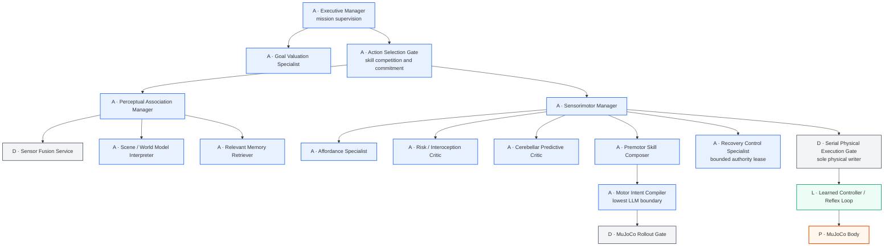
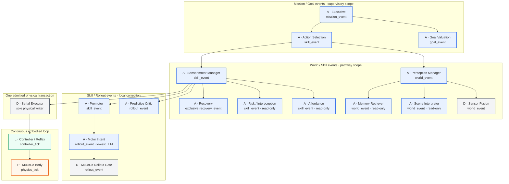
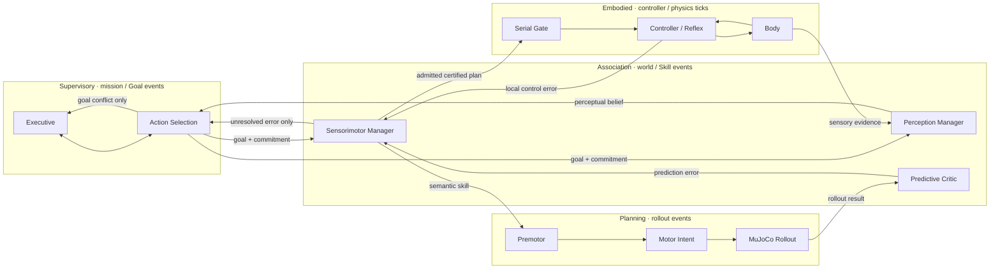
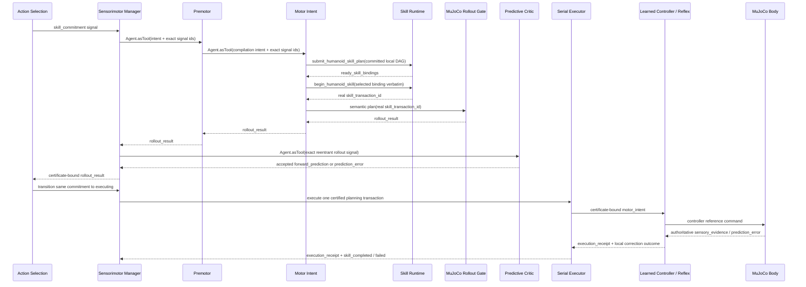
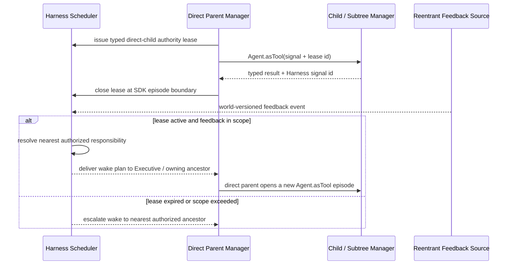

# HEAR Neural Hierarchy

Status: implementation contract, verified against the OpenAI Agents SDK and
robot-control literature on 2026-08-13.

## Non-negotiable thesis

HEAR is a **hierarchical Agent Harness**, not a collection of peer Agents.
Every reasoning node has exactly one control parent. A parent normally invokes
a child as an OpenAI Agents SDK tool and retains control. Siblings never call
or signal each other: parallel children return independently to their common
Manager, which is the only join and arbitration point. No expert can bypass
its Manager to mutate the robot.

The current Motor Intent structural identity is
`humanoid-motor-intent-compiler`. The retired V2 identity
`humanoid-motion-reference` is historical receipt/checkpoint provenance only;
it cannot open a current planning episode.

The hierarchy is a recursive control system rather than a long prompt chain:

- descending signals carry goals, constraints, affordances, commitments, and
  termination conditions;
- ascending signals carry sensory evidence, prediction error, risk, physical
  completion, and failure;
- every layer has a bounded local correction scope and a distinct cadence;
- only an error outside that scope is escalated to its parent;
- cognition stops at semantic motor intent; trajectories and per-frame
  control stay deterministic or learned;
- exactly one serial authority can write physical state.

Every model-to-model delegation has the same wire law:

- the parent sends only a concise typed `intent`, exact causal `signal_id`
  references, priority, and horizon;
- the Harness constructs the child's own context anchor and injects the cited
  world-versioned signals;
- parent context, sibling output, Sessions, and JSON-encoded copies of an
  anchor are never transferred;
- the child returns one typed ascending signal to its direct parent.

This is a hierarchy boundary, not a prompt optimization. Passing a parent's
whole context to a child would collapse distinct neural layers into a shared
flat transcript and force compatible models to generate JSON inside JSON. The
executable delegation schema therefore has no arbitrary `payload_json` field.

## Structural ownership tree

Solid edges are ownership and control. Every non-root node appears under one
and only one parent.

Legend: `A` is an OpenAI Agents SDK model Agent, `D` is a deterministic
runtime service, `L` is a learned/reference controller loop, and `P` is the
physical plant. **Eighteen structural nodes do not mean eighteen LLMs:** this
contract contains thirteen model Agents and five non-model nodes.



The predictive Critic does not own the Rollout Gate. The Motor Intent branch
owns deterministic planning and rollout. The resulting `rollout_result` is a
typed reentrant signal to the predictive Critic, which compares expected and
observed outcomes without becoming a second actuator. This preserves a strict
tree while retaining a cerebellar parallel pathway.

Feedback provenance is deliberately separate from control authority. Every
direct-child SDK call creates a durable `invocation_id`; its lease and every
signal produced inside that call carry the same identity. The lease also names
the owning Manager's `parent_episode_id`. Parallel siblings therefore have
different invocation IDs but the same parent episode, and only that Manager may
join signals sharing its episode. Payload equality, queue position, and signal
kind are never used as episode identity.

An
ascending or reentrant signal retains `source_authority_lease_id`, identifying
the completed parent-child episode that produced it, but carries no live
`authority_lease_id`. If that feedback wakes Predictive Critic, Sensorimotor
Manager must issue a new direct-child lease for the new `Agent.asTool()`
episode. A closed Rollout Gate lease proves causality; it never gives
Predictive Critic a second parent or permission to run.

The Recovery Specialist is **not** an SDK handoff and never becomes a second
root. Sensorimotor Manager remains its only parent, freezes its ordinary child
leases, and opens a separate Recovery SDK episode under one exclusive Harness
lease. Recovery cannot call Premotor or Executor behind that parent. It returns
one recovery proposal or escalation, closes the lease, and only then may the
ordinary Sensorimotor branch resume.

Recovery is reachable only through the complete production control path:

```text
Executive -> Action Selection -> Sensorimotor Manager -> Recovery
```

The triggering `prediction_error`, `skill_failed`, or `escalation` is rebound
at each direct descending edge. A recovery `skill_proposal` returns through the
same parents and only Action Selection may bind it as the replacement
commitment. A recovery `escalation` also returns through Sensorimotor and Action
Selection before Executive can revalue the Goal. Recovery has no
`risk_assessment` holding state: its bounded decision must either propose a
replacement Skill or escalate.

This is the **ownership graph**, not the data-flow graph. The rollout result,
body sensation, and reflex error shown later are typed feedback routes; none
creates another parent. The executable contract rejects multiple parents,
peer-to-peer Agent routes, parallel physical writers, and a Predictive Critic
that attempts to own the Rollout Gate.

The tree is the single source of structural truth. A feedback edge, a wake-up
event, a shared model provider profile, or access to the same durable world
does **not** create another parent. A non-root model invocation is legal only
when the direct parent created the typed signal and issued the matching
subtree authority lease.

## Canonical architecture: ownership, implementation, and cadence

The same ownership tree is shown below in five temporal bands. Vertical solid
arrows are the only control edges. A node's band states when it may activate;
it does not give that node another parent. Model Agents are event-driven. Only
Controller / Reflex and MuJoCo Body run continuously at their configured rates.



This diagram is intentionally not a brain-region catalogue. The neuroscience
analogy constrains routing: descending intent, ascending error, local
correction, temporal abstraction, and one motor output path. It does not imply
that every biological circuit should become an LLM.

## Feedback graph: recursive multi-timescale loops

Dashed conceptual feedback below is data, never ownership. In particular,
`Rollout Gate -> Predictive Critic` is a whitelisted `rollout_result`, while
`Predictive Critic -> Sensorimotor Manager` is an ordinary child-to-parent
return. This distinction is what permits a neural-style recurrent loop without
turning the hierarchy into a peer Agent graph.



This is not a fixed-rate LLM cascade. Events wake only the pathways whose
inputs changed or whose staleness deadline expired. Controller and reflex
loops continue while cognitive Agents are idle.

## Harness phase machine: temporal authority

The control tree answers *who owns whom*. The phase machine answers *what is
legal now*. These are separate contracts. Prompts may explain order, but only
the Harness may enforce order or enable tools.

```mermaid
stateDiagram-v2
    [*] --> GoalValuation: run started / no active Goal
    GoalValuation --> PerceptionCapture: Goal selected
    PerceptionCapture --> PerceptionFork: sensory_evidence
    state PerceptionFork {
      [*] --> Scene
      [*] --> Memory
      Scene --> Joined
      Memory --> Joined
      Joined --> [*]
    }
    PerceptionFork --> SkillProposal: perceptual_belief
    SkillProposal --> CommitmentAuthorization: Sensorimotor returns skill_proposal
    CommitmentAuthorization --> AssessmentFork: Action Selection establishes one commitment
    state AssessmentFork {
      [*] --> Affordance
      [*] --> Risk
      Affordance --> Assessed
      Risk --> Assessed
      Assessed --> [*]
    }
    AssessmentFork --> Premotor: both assessments joined under commitment
    Premotor --> MotorIntent: concise compilation intent + cited signals
    MotorIntent --> RegisterSkillDAG: submit_humanoid_skill_plan
    RegisterSkillDAG --> BindSkillNode: begin_humanoid_skill
    BindSkillNode --> Rollout: semantic plan with real skill_transaction_id
    Rollout --> Predictive: real rollout_result
    Predictive --> ExecutionAuthorization: accepted and certified rollout_result
    ExecutionAuthorization --> Execute: Action Selection transitions commitment to executing
    Predictive --> Recovery: error outside local scope
    Execute --> ResolveCommitment: execution_receipt + skill_completed / failed
    ResolveCommitment --> PostExecutionSense: Action Selection closes commitment
    Recovery --> CommitmentAuthorization: lease closed with replacement proposal
    Recovery --> Escalate: local recovery unavailable
    PostExecutionSense --> CycleBarrier: current perceptual_belief joined
    CycleBarrier --> CompleteSkill: Executive validates physical completion
    PostExecutionSense --> AssessmentFork: Goal preserved; replan Skill
    Escalate --> GoalValuation: Sensorimotor -> Action Selection -> Executive
    CompleteSkill --> ActionSelection: resolve commitment from real feedback
```



Only two states admit concurrent Agent calls: `PerceptionFork` and
`AssessmentFork`. The Harness dynamically exposes exactly the tools valid for
the current state. It never exposes Premotor alongside unfinished critics or
Executor before a real Predictive result. Thus model tool ordering is a
choice only among currently legal alternatives, not a safety mechanism.

## Neural-to-embodied Skill bridge

The durable neural commitment and the embodied action binding are deliberately
different authorities. Action Selection owns the former; Motor Intent must
materialize the latter through the existing semantic Skill APIs before any
planner can run. No Harness layer fabricates a transaction identifier and a
neural UUID is never reused as an embodied Skill transaction.



`submit_humanoid_skill_plan` and `begin_humanoid_skill` are state transitions
inside one bounded Motor Intent SDK episode. They do not terminate that episode
and do not produce a rollout signal. Only one accepted semantic planning call
may return `rollout_result`; a rejected plan returns `escalation` unchanged
through Premotor. This prevents both the former `skill_transaction_id="null"`
failure and the former relabeling of a child escalation as `skill_proposal`.

## Authority leases and event wake-up

The Scheduler is an interrupt dispatcher, not a second Manager. A direct
wake-up of a lower Manager is valid only while a durable lease issued by every
ancestor on the path is active. The lease binds:

- issuing parent, target child, Goal epoch, skill commitment and world revision;
- allowed signal kinds and correction scope;
- expiry revision/time and one active invocation identity;
- suspension state for the normal branch and an explicit close reason.

Ordinary descending work obtains a short subtree lease when the parent invokes
`Agent.asTool()`. Its expiry horizon is checked before admission and during
recovery, but never asynchronously revokes the exact process-local SDK episode
that is already on the invocation stack. That episode closes its lease at the
lexical `Agent.asTool()` boundary. This prevents a slow model response from
making a tool disappear between selection and SDK execution. Reentrant feedback
cannot invent new authority; expired orphan, replaced, or Goal-incompatible
leases force escalation to the direct parent.

Lease issuance is restart-aware. Re-entering the same stable SDK invocation is
idempotent; issuing a genuinely new episode first expires old horizons that are
not present in the process-local invocation chain. A crashed episode therefore
cannot block or authorize its successor.

Recovery uses the same law with exclusive scope. Sensorimotor Manager freezes
normal selection, grants Recovery a bounded decision lease, and revokes it on
completion, timeout, world-version invalidation, cancellation, or escalation.
Recovery cannot execute physics and cannot call Premotor or Executor; its only
return path is its owning Sensorimotor Manager.



The Scheduler never calls a child Agent as a new root. It resolves a desired
responsibility against durable leases, then gives the one Executive root a wake
plan. Only the structural parent can open the next `Agent.asTool()` episode.

The Scheduler is deliberately a **single-lane Executive interrupt mux**, not a
general Agent worker pool. Multiple external events are coalesced and delivered
to one Executive episode serially. Parallel execution starts only after a
running Manager explicitly forks one of the two read-only sibling groups.

A lower-layer wake is accepted only when the Harness can reconstruct a complete,
invocation-linked authority path from Executive to that node. Every hop must be
an active direct-parent lease, and the child lease's `parent_invocation_id` must
equal the owning parent lease's `invocation_id`. A surviving isolated lower
lease therefore cannot turn Predictive, Recovery, or any other descendant into
a second root; the wake is escalated to the nearest ancestor with a complete
path, ultimately Executive.

## OpenAI Agents SDK mapping

The implementation uses the SDK for its intended responsibilities and does
not recreate those facilities in HEAR:

| Node | SDK form | Parent interaction | Session |
| --- | --- | --- | --- |
| Executive | root `Agent` run by `Runner` | owns the supervisory turn | independent |
| Goal Valuation | child `Agent.asTool()` | Executive retains control | independent |
| Action Selection | child `Agent.asTool()` | Executive retains control | independent |
| Perception Manager | child `Agent.asTool()` | Action Selection retains control | independent |
| Scene Interpreter / Memory Retriever | child `Agent.asTool()` | Perception Manager retains control | independent each |
| Sensorimotor Manager | child `Agent.asTool()` | Action Selection retains control | independent |
| Affordance / Risk / Predictive / Premotor | child `Agent.asTool()` | Sensorimotor Manager retains control | independent each |
| Recovery Control | independent SDK run under an exclusive parent-issued Harness lease | Sensorimotor remains the parent and freezes its ordinary branch | independent |
| Motor Intent | child `Agent.asTool()` | Premotor retains control | independent |

`Agent.asTool()` is the default parent-child mechanism because the OpenAI
Agents SDK keeps the original Agent active after the nested Agent returns,
whereas a handoff gives the next Agent the conversation and makes it active.
HEAR uses no SDK handoff in the control tree. Recovery instead runs as a
separate SDK episode under a short-lived, exclusive Harness authority lease;
its structural parent and isolated Session do not change.

This is checked against the constructed SDK object graph, not only documented:
the runtime Manifest rejects handoffs, shared Agent objects, shared Sessions,
undeclared MCP surfaces, missing child-control tools, and any canonical child
tool mounted on a node other than its structural parent.

Every model Agent has its own `FileSession`. No child receives another Agent's
Session, raw transcript, or compacted transcript. A parent constructs a new,
typed, bounded neural input from durable state for each invocation. SDK
Sessions preserve each Agent's own continuity only.

Read-only retrieval is also episode-bounded. Relevant Memory and Recovery may
call `recall_embodied_history` once per invocation; after a successful recall
the Harness removes that capability and leaves typed submission as the only
next step. Empty history is a valid result, not a reason to poll the same store.

`Agent.asTool()` provides the nested Agent loop and Manager-owned return, but
it does not replace HEAR's embodied phase, revision, causality, or actuation
authority. SDK dynamic tool availability is used to expose only the phase-safe
surface. Harness leases and typed signals remain the source of robot authority.

Every formal neural control turn uses `tool_choice=required`; prose cannot
replace a typed control edge or state transition. DeepSeek's OpenAI-compatible
thinking endpoint rejects that combination, so HEAR disables provider thinking
only for these formal control turns while retaining the same model and tool
surface. Harness validation, Goal mutations, commitment transitions, rollout
certificates, and physical admission remain authoritative.

## Node and implementation audit

The thirteen current model nodes have distinct schemas, tool surfaces, evidence
or decision contracts, and Sessions. The remaining five structural nodes stay
outside the LLM boundary. This is the current implementation split, not a claim
that a neuroscience label intrinsically deserves a model call.

| Model Agent | Unique contract that justifies isolation | Must not own |
| --- | --- | --- |
| Executive | Mission continuity and supervisory Goal conflict | Perception, Skills, trajectories |
| Goal Valuation | Durable Goal DAG proposal/selection/retirement tools | Motor selection or physics |
| Action Selection | One active Skill commitment and pathway gating | Motion compilation or execution |
| Perception Manager | Current-sensation fan-out and belief join | Goal mutation or motor admission |
| Scene Interpreter | Spatial/semantic interpretation of current evidence | Historical substitution or action |
| Memory Retriever | Provenance-bounded embodied recall | Current sensing or control |
| Sensorimotor Manager | Join affordance/risk/prediction and admit one Skill | Goal replacement or joint commands |
| Affordance | Reachability and task-opportunity hypotheses | Risk arbitration or planning |
| Risk / Interoception | Balance/contact/collision inhibition | Alternate motor commands |
| Predictive Critic | Compare real rollout with terminal contract | Rollout ownership or actuation |
| Premotor | Compose a short semantic Skill DAG | Geometry, trajectories or physics |
| Motor Intent | Bind one Skill to one existing deterministic planner | Joint values or MuJoCo writes |
| Recovery | Exclusive bounded recovery decision under lease | Premotor bypass or physical execution |

| Non-model node | Why it is not an Agent |
| --- | --- |
| Sensor Fusion | Authoritative observation is deterministic sensor I/O, not interpretation |
| MuJoCo Rollout Gate | Feasibility and safety certificates must come from cloned physics |
| Serial Executor | Physical mutation is a hash-bound transaction, not another model opinion |
| Controller / Reflex | Runs at control rate using trained/reference policy and local feedback |
| MuJoCo Body | Is the authoritative physical plant |

This audit is also a deletion rule: if two model nodes later expose the same
policy, tools, input evidence, cadence, and output contract, they should be
merged. Conversely, a new Agent is not justified merely by assigning it a
neuroscience-inspired name.

Several roles are explicitly candidates for learned or deterministic kernels
behind the same structural interface: memory retrieval, geometric affordance,
balance/contact risk, and rollout scoring. Replacing one of their model
implementations does not flatten the hierarchy; its parent, typed input/output,
cadence, correction scope, and lack of physical authority remain unchanged.

## Cadence and correction contract

The manifest persists these fields for every structural node. They are part of
the hierarchy identity and cannot be changed while silently reusing an old
Agent epoch.

| Cadence | Eligible nodes | Activation law | Maximum consequence |
| --- | --- | --- | --- |
| `mission_event` / `goal_event` | Executive, Goal Valuation | mission start, Goal conflict, Goal completion | revalue the Goal epoch |
| `world_event` | perception subtree | new/stale authoritative observation | update belief only |
| `skill_event` | Action Selection, Sensorimotor, Affordance, Risk, Premotor | missing/failed/completed commitment or relevant world change | propose, inhibit, or replace one Skill |
| `rollout_event` | Motor Intent, Rollout Gate, Predictive | one bound candidate requires simulation or review | certify/reject that candidate |
| `execution_transaction` | Serial Executor | one committed and certified plan | mutate physical state through one mutex |
| `recovery_event` | Recovery | risk/error exceeds ordinary local scope | return one bounded proposal or escalate |
| `controller_tick` | Controller / Reflex | continuously while admitted execution is active | track reference and correct local error |
| `physics_tick` | MuJoCo Body | configured physics clock | evolve the plant and expose sensation |

No model node may declare `execution_transaction`, `controller_tick`, or
`physics_tick`. No child may own a broader correction scope than its direct
parent. These rules are asserted by the executable hierarchy contract rather
than left to prompts.

## Parallelism without peer authority

Parallel execution exists *inside a manager-owned fan-out*, not as a peer
Agent society:

```mermaid
sequenceDiagram
    participant AS as Action Selection Gate
    participant PM as Perception Manager
    participant SF as Sensor Fusion
    participant SI as Scene Interpreter
    participant MR as Memory Retriever
    participant SM as Sensorimotor Manager
    participant AF as Affordance
    participant RI as Risk
    participant PR as Premotor
    participant MI as Motor Intent
    participant RG as Rollout Gate
    participant CP as Predictive Critic
    participant EX as Serial Executor
    participant RF as Learned Controller / Reflex
    participant BD as MuJoCo Body

    AS->>PM: agent.asTool(perception request)
    PM->>SF: capture authoritative observation
    SF-->>PM: typed sensory evidence
    par manager-owned read-only interpretation
      PM->>SI: agent.asTool(scene, child invocation S, parent episode P)
      PM->>MR: agent.asTool(memory, child invocation M, parent episode P)
    end
    PM->>PM: join only outputs whose parent_episode_id = P
    PM-->>AS: typed perceptual belief
    AS->>SM: agent.asTool(goal + belief; no commitment)
    par manager-owned pre-action assessment
      SM->>AF: agent.asTool(affordance, child invocation A, parent episode Q)
      SM->>RI: agent.asTool(risk, child invocation R, parent episode Q)
    end
    SM->>SM: join only outputs whose parent_episode_id = Q
    SM-->>AS: typed skill_proposal + signal id
    AS->>AS: establish one durable commitment
    AS->>SM: new agent.asTool episode(goal + belief + commitment)
    SM->>PR: agent.asTool(committed skill composition)
    PR->>MI: agent.asTool(bound semantic motor intent)
    MI->>RG: deterministic planning + MuJoCo rollout
    RG-->>CP: typed rollout_result with source lease provenance
    SM->>CP: agent.asTool(interpret completed rollout)
    CP-->>SM: typed prediction_error / forward_prediction accepted=true
    CP-->>SM: Harness issues one rollout_certificate
    SM-->>AS: accepted rollout_result + certificate binding
    AS->>AS: authorize commitment -> executing
    AS->>SM: new agent.asTool execution episode
    SM->>EX: atomically admit transaction + consume certificate
    EX->>RF: publish certified motor_intent under child lease
    RF->>BD: publish controller reference under child lease
    BD->>BD: execute real MuJoCo frames in the Executor-owned transaction
    BD-->>RF: sensory_evidence + physical endpoint
    opt physical failure or uncorrected deviation
      BD-->>RF: prediction_error
      RF-->>EX: typed local prediction_error
    end
    RF-->>EX: execution_receipt + skill_completed / failed
    EX-->>SM: causally derived execution_receipt + skill_completed / failed
    SM-->>AS: typed execution feedback
    AS->>AS: resolve the commitment
    AS->>PM: post-execution sensing request bound to completion feedback
    PM->>SF: capture world after the physical revision
    SF-->>PM: authoritative post-execution sensory evidence
    PM-->>AS: joined post-execution perceptual_belief
    AS-->>E: bounded perceptual_belief with causal signal id
    E->>E: close cycle only when physical and neural barriers agree
```

The apparent `RG -> CP` diagonal is data feedback only. It cannot activate CP.
`SM -> CP` is the sole control edge and always creates a fresh direct-child
lease. The certificate is therefore a Sensorimotor-owned admission artifact,
not a new ownership link.

The physical tail is equally strict. The SDK tool call and action ledger keep
Serial Executor as the sole physical writer, while the actual controller and
plant are represented by nested deterministic child episodes. The unprojected
physical receipt is never handed to a model; it is reduced to bounded body
sensation (endpoint, trajectory identity and controller-usage evidence), then
returned along `Body -> Reflex -> Executor -> Sensorimotor`. A failed physical
result additionally creates a durable Reflex prediction-error record. There is
no direct `Body -> Sensorimotor` shortcut and no LLM activation per frame.

Both SDK layers must permit the two explicit fan-outs: model settings allow
parallel tool calls, and Runner tool execution allows more than one concurrent
function tool. Only Scene/Memory and Affordance/Risk belong to those fan-outs.
Premotor waits for pre-action assessment; Predictive Critic waits for a real
rollout result. The executor is excluded from every parallel group and remains
protected by the existing action mutex.

There are no lateral sibling messages. Parallelism means **fork from parent,
independent read-only work, join at the same parent**. That is concurrency
inside a hierarchy, not peer multi-Agent collaboration.

Harness contract v34 makes those joins and the execution-feedback closure
executable authority rules. A
Perception Manager cannot emit `perceptual_belief` unless the same Manager
episode contains and explicitly cites Sensor Fusion, Scene Interpreter, and
Memory Retriever signals. A Sensorimotor Manager cannot emit `skill_proposal`
unless the same episode contains and explicitly cites its incoming perceptual
belief plus Affordance and Risk results. Signals left by another episode never
enable a fork or satisfy a join.

OpenAI-compatible endpoints are not assumed to implement `json_schema`
response formatting. Every model node submits its final typed neural signal
through an SDK function tool whose parameter schema is that node's output
schema. Assistant prose is never accepted as a control signal.
Manager submission tools are capability-gated by the same invocation-local
fork/join and state-mutation barriers. A Manager cannot merely assert that a
child ran, a commitment exists, or a rollout was accepted: the submission tool
is absent until the corresponding Harness signal or durable state transition
exists, and submitted source IDs must cite that exact result.
Signal freshness follows invocation identity plus the signal TTL, not the
revision at which a later phase transition was recorded. This matters in the
live MuJoCo loop: physics may advance between child return and parent join, but
cannot invalidate a still-pending result from the same process-local Manager
episode. Both the signal's invocation and its owning `parent_episode_id` are
recognized. After restart that lexical episode no longer exists, so the durable
TTL again becomes the strict admission boundary.
Manager output gates distinguish child returns from the Manager's own
descending invocation input. Action Selection cannot bounce an ordinary belief
back upward: it must drive Sensorimotor selection, and may return a belief to
Executive only after the post-execution Perception join reaches
`cycle_completion`.

The same contract now governs the complete actuation path. Sensorimotor forwards
only its own joined belief, affordance, risk, and commitment signals to Premotor;
Premotor forwards only bounded belief and commitment state to Motor Intent. The
Rollout Gate returns the exact IDs of both its Motor Intent return signal and its
reentrant Predictive feedback without adding those IDs to the physics receipt
payload. Predictive selects only the `Rollout Gate -> Predictive` reentrant
signal, and a successful Serial Executor returns the exact execution-receipt and
completion signal IDs to Sensorimotor. This keeps payload hashes stable while
preserving end-to-end causal identity.

## Typed neural signal protocol

Agents do not share memory. They exchange `NeuralSignal` records containing:

- source and target node plus neural layer;
- descending, ascending, or one of three whitelisted reentrant feedback routes;
- world frame and world revision;
- revision TTL and priority;
- concrete child `invocation_id`, parent invocation, and owning
  `parent_episode_id`;
- causal parent signal IDs;
- `authority_lease_id` only on descending control, or
  `source_authority_lease_id` only on ascending/reentrant provenance;
- a typed signal kind and bounded JSON payload;
- pending, consumed, expired, or superseded state.

At the model function-call boundary the submission tool accepts that payload as
a native JSON value. The Harness validates and canonicalizes it into the
internal `payload_json` envelope before routing. This avoids asking a model to
correctly escape a second JSON wire format inside the function arguments while
preserving the existing durable signal representation.

At the parent-facing `Agent.asTool()` boundary, `source_signal_ids` is rebound
to the single ascending signal created for that direct ownership edge. The
child's internal source IDs and the closed `source_authority_lease_id` remain
in durable Harness state as causal ancestry; they are not exposed as a second
competing ID namespace in the tool receipt. A parent therefore always copies
the returned `source_signal_ids` when citing its immediate child.

Premotor is a structural pass-through after it has composed and delegated one
bounded Motor Intent: the typed Motor Intent `rollout_result` or `escalation`
directly terminates the Premotor SDK episode through `toolUseBehavior`. There
is no second model turn that rewrites the child's payload or causal IDs. This
does not let the Harness select motion; it removes a redundant transcription
step after the child has already made and validated the planning decision.

Sensorimotor cites only its direct Premotor `rollout_result` when activating
Predictive Critic. The Harness deterministically follows that signal's durable
causal ancestry to the unique reentrant Rollout Gate signal and binds it into
the Predictive delegation edge. This preserves single-parent visibility while
still proving that Predictive evaluated the exact MuJoCo rollout rather than a
model-authored copy.

There is no `lateral` direction in the signal schema. Siblings cannot build a
hidden shared-memory network around their Manager.

The root result uses the same V3 neural envelope as every other model node.
Verified `cycle_completed` and `satisfied_goal_completed` records live inside
`payload_json` of an Executive `skill_completed` signal; Mission Runner parses
that payload only after validating the complete envelope. A child tool failure
is a control-path exception, never an SDK-generated prose result, and every
Manager aggregation de-duplicates its causal signal ids before publication.

The rollout certificate additionally binds both the deterministic rollout
invocation and the Predictive invocation. Serial admission copies those IDs
into the physical execution ledger. A second pending rollout, even with an
identical payload, cannot be substituted for the certified episode.

Each child keeps its own structured output contract. The parent validates that
specific contract first, then extracts the common neural envelope for routing;
Predictive fields such as `accepted` are not erased by coercing every child into
one generic Agent schema.

Invocation identity is restart-stable. A nested Agent-tool invocation derives
its UUID from the SDK tool-call identity, so an SDK retry or serialized
RunState resume re-enters the same episode. The Executive root episode is bound
to the durable autonomous-cycle UUID (or hierarchy epoch before a cycle
exists). Restart never silently creates a different parent for already durable
child signals.

Contract changes require an explicit cognitive epoch boundary. A normal resume
rejects older hierarchy state instead of filling missing fields. The explicit
fresh-Agent-epoch operation is permitted only when no physical execution or
commit outbox entry is unfinished; it archives old model Sessions and rebuilds
neural signals, leases, commitments, certificates, and context memory while
preserving the physical checkpoint, Goal DAG, committed actions, and embodied
memory. Mutable action-runtime cognition is epoch-bound as well: the fresh
epoch clears Skill plans, active bindings, recovery policy, transit clearance,
and grounding observations. It preserves only the monotonically increasing
physical-execution revision watermark. Durable action events from an older
epoch remain historical receipts; they cannot repopulate the new epoch's hot
Motor Intent cache.

Delegation parameters are generated per control edge from the same signal
contract used by runtime routing and the Agent Manifest. A model cannot select
a signal kind that is legal elsewhere in the tree but illegal on its own edge.

The durable hierarchy additionally owns:

- one `NeuralSkillCommitment` with an owner, Goal epoch, terminal contract,
  source signals, and the world revision at which it was validated;
- bounded `NeuralPredictionError` records with magnitude, tolerance, and a
  correction scope of local, pathway, or supervisory;
- per-pathway cadence state for event scheduling.
- one explicit Harness phase record and durable direct-parent authority leases
  with Goal epoch, commitment, world revision/time expiry, invocation identity,
  allowed signal kinds, exclusivity, suspended branches and close reason.
- one single-use `NeuralRolloutCertificate` issued only after Predictive accepts
  a real reentrant MuJoCo rollout. It binds the commitment, Goal epoch, planning
  transaction/action, rollout payload hash, both causal signal IDs, world
  revision horizon and the one physical execution transaction that consumes it.

A child cannot reinterpret an expired coordinate or binding. Sensory beliefs
must be at least as new as the phase that consumes them. Commitment-bound
feedback may cross phase boundaries when its source lease names the same
commitment and its signal remains inside the revision horizon. That historical
lease is provenance, not current authority. Every new child episode receives a
new direct-parent lease. Continuous station keeping advances physical revision,
so semantic invalidation is never approximated by `revision == now`.

## Escalation law

1. Controller/reflex corrects trackable perturbations locally.
2. Predictive and risk pathways correct or inhibit one skill locally.
3. Sensorimotor Manager changes the motor program while preserving the active
   Goal and commitment when possible.
4. Action Selection releases or replaces a skill commitment when the lower
   layer cannot recover.
5. Executive revalues or retires a Goal only when action selection reports a
   supervisory conflict.

This prevents every small motor deviation from causing a costly top-level
replan and prevents a lower layer from silently changing the mission.

## Physical boundary

Motor Intent is the lowest model Agent. It chooses one existing semantic
planning call and copies current bindings. It does not emit joint angles,
keyframes, controller commands, or MuJoCo state.

Below it:

1. deterministic solvers compile geometry and candidate trajectories;
2. MuJoCo forward rollouts certify feasibility and terminal conditions;
3. Predictive acceptance mints one single-use, hash-bound rollout certificate;
4. Action Selection changes the same commitment to `executing` only from the
   certificate-bound ascending chain;
5. the single Execution Gate writes the certificate binding into the execution
   ledger and consumes it for exactly one physical transaction in the same
   durable admission cut; crash recovery reconstructs both sides from that one
   transaction identity;
6. Executor publishes a certified `motor_intent` to Reflex, Reflex publishes
   the controller reference to Body, and learned/reference controllers plus
   contact reflex logic run at control rate inside the admitted transaction;
7. Body sensation and any physical prediction error ascend strictly through
   `Body -> Reflex -> Executor -> Sensorimotor` as typed signals.

HEAR's existing `HumanoidRunRuntime.#actionMutex` remains the sole physical
write serialization boundary. While no physical transaction owns the plant,
`HumanoidPhysicsClock` advances station keeping on the controller cadence even
while model Agents are thinking. During an admitted long-horizon Skill, the
Serial Executor temporarily owns the plant and the learned/reference controller
advances every frame inside that one transaction. Cognitive parallelism never
weakens either rule.

In a V3 epoch, deterministic action authority accepts only
`capture_sensor_fusion` for observation and
`execute_certified_motor_intent` for physical execution. The retired V2
`delegate_humanoid_sentry` and `delegate_physics_executor` edges are accepted
only when the current manifest itself is V2; archived V2 authority is
read-only and cannot sign a new V3 action.

## Evidence and adopted ideas

The design adopts established components rather than claiming a new robotics
theory:

- [Official OpenAI orchestration and handoffs](https://developers.openai.com/api/docs/guides/agents/orchestration)
  distinguishes Manager-owned Agent tools from conversation handoffs. The
  installed OpenAI Agents SDK `Agent.asTool()` contract likewise states that a
  nested Agent receives generated input, returns to the original Agent, and
  does not take over the conversation.
- [Official OpenAI Agent definitions](https://developers.openai.com/api/docs/guides/agents/define-agents)
  defines separate instructions, tool surfaces, policies, and `outputType` as
  the reasons to split specialists.
- [Official OpenAI running Agents guide](https://developers.openai.com/api/docs/guides/agents/running-agents)
  defines the Agent loop and Sessions as one conversation-state strategy.
- [RT-H](https://arxiv.org/abs/2403.01823) provides an explicit hierarchy from
  tasks through language motion abstractions to actions.
- [Hi Robot](https://arxiv.org/abs/2502.19417) demonstrates hierarchical
  high-level reasoning plus higher-frequency low-level action chunks under
  situated feedback; its hierarchy outperforms a flat policy in its ablation.
- [GR00T N1](https://arxiv.org/abs/2503.14734) supports a slow reasoning system
  coupled to a fast real-time motor system.
- [Systematic Hi-VLA orchestration study](https://arxiv.org/abs/2606.10267)
  unifies planner/controller systems through an options-style interface and
  identifies the policy interface, switching law, observations, and memory as
  core design variables rather than the number of conversational Agents.
- [Hierarchical world models for humanoid control](https://arxiv.org/abs/2405.18418)
  uses a high-level visual policy to issue lower-dimensional references to a
  reusable proprioceptive tracking policy instead of emitting joint control.
- [Hierarchical visuomotor control of humanoids](https://arxiv.org/abs/1811.09656)
  separates visual high-level skill coordination from proprioceptive low-level
  motor policies.
- [LUCID](https://arxiv.org/abs/2608.07746) freezes a reusable latent-conditioned
  low-level controller and plans at a macro timescale through imagined
  skill-level dynamics; its ablations show gains from both imagined
  macro-transitions and a structured high/low interface.
- [SMPC demonstrations with sparse offline-to-online RL](https://arxiv.org/abs/2608.12063)
  supports a high-level learner over a low-level stability controller and using
  simulation planning as a teacher.
- [Basal-ganglia action selection](https://pubmed.ncbi.nlm.nih.gov/11417052/),
  [cerebellar internal models](https://pubmed.ncbi.nlm.nih.gov/21227230/), and
  [spinal motor primitives](https://pubmed.ncbi.nlm.nih.gov/20107059/) motivate
  the distinct selection, prediction, and fast motor pathways.
- [Optimal feedback control](https://pubmed.ncbi.nlm.nih.gov/12404008/) motivates
  continuous local correction instead of replaying open-loop trajectories.

These sources constrain the decomposition. HEAR's engineering contribution is
their integration with OpenAI Agents SDK ownership, typed world-versioned
signals, existing MuJoCo rollout certificates, and one durable physical
authority.

## Rejected designs

- peer Agents sharing one transcript or global scratchpad;
- one Coordinator phase machine pretending to be a hierarchy;
- a linear Planner -> Actor chain with no ascending prediction/risk feedback;
- parallel physical tools or multiple MuJoCo writers;
- LLM calls at physics or controller frequency;
- fallback ladders that conceal one root failure behind multiple substitutes;
- SDK handoff anywhere in the structural control tree;
- stale coordinates copied from Agent history;
- a shared deterministic service with multiple structural parents.
- direct messages or shared transcript between sibling Agents;
- parallelizing nodes whose inputs do not yet exist, such as Predictive Critic
  before a candidate rollout has completed.
