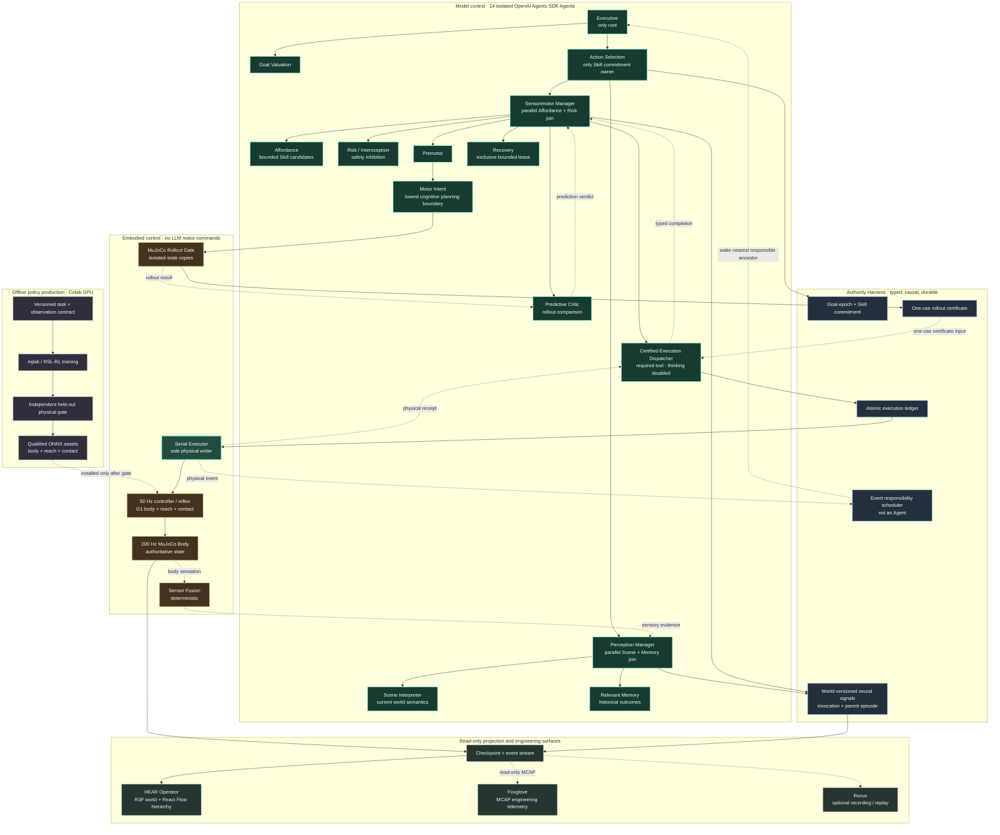

# HEAR System Architecture

Status: implementation overview for the neural-hierarchy V3 runtime.

HEAR is a hybrid system: model Agents choose semantic goals and Skills, the
Harness owns causality and authority, and learned/deterministic controllers
close the fast physical loop. Offline training improves the controller; it
does not move trajectory authority into the LLM hierarchy.

## How to read the diagram

- Solid arrows in the Agent region are direct control ownership. The complete
  19-node single-parent tree is defined in
  [neural-hierarchy-v3.md](neural-hierarchy-v3.md).
- Dotted arrows are evidence, feedback, offline deployment, or scheduler
  wake-up. They never create another control parent.
- Free cognition and planning end at Motor Intent. It emits bounded semantic
  motor intent, not joint values, trajectories, poses selected by Executive, or
  physical writes. The only lower model node is the non-thinking Certified
  Execution Dispatcher, whose required call can target only the serial writer.
- A rollout result must be accepted and converted to a one-use certificate
  before the atomic ledger can admit Serial Executor. Only that executor can
  mutate the authoritative MuJoCo body.
- The controller is a cascade: trained G1 body control remains active, the
  reach policy supplies the 14-dimensional upper-body reference, and the
  contact policy receives the 8-dimensional hand authority only during an
  admitted contact-rich Skill.
- The UI, Foxglove, and Rerun are projections. None is part of the control
  hierarchy and none may author a world revision or success receipt.

## Runtime cadences

| Band | Activation | Authority |
|---|---|---|
| Executive / Goal | mission and terminal events | goal continuation or retirement |
| Perception / Sensorimotor | world and Skill events | belief and bounded Skill proposal |
| Premotor / Motor Intent | committed Skill and rollout events | semantic motor intent |
| Dispatcher / Serial Executor | one admitted physical transaction | required model dispatch and sole write |
| Controller / MuJoCo | 50 Hz / 200 Hz continuous loop | actuator command / physical truth |
