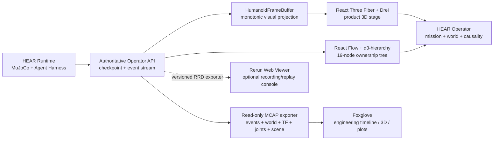

# HEAR Visualization Stack

Status: adopted implementation direction with Foxglove MCAP export implemented; reviewed against upstream projects on 2026-08-15.

HEAR does not use a robotics dashboard as its product shell. The product UI must combine the authoritative MuJoCo world, mission state, strict single-parent Agent authority, typed feedback, and physical receipts in one interface. Existing robotics viewers remain valuable, but they solve narrower engineering and replay problems.

## Adopted stack

- **Product world:** React Three Fiber 9 and Drei own the Three.js scene lifecycle, camera controls, WebGPU initialization, WebGL2 fallback, resize, invalidation, and React cleanup. The MuJoCo snapshot remains the only pose authority.
- **Agent architecture:** React Flow renders the live 19-node control tree; d3-hierarchy performs deterministic single-root layout. Edges represent direct ownership only. Feedback never creates a visual second parent.
- **Engineering diagnostics:** Every Operator run can now be exported as a self-contained MCAP file. It carries durable runtime events, authoritative world snapshots, 43 joint states, Z-up Foxglove frame transforms, contact/center-of-mass SceneUpdate markers, and navigation lines. The exporter registers no command channel. A future Foxglove WebSocket server may stream the same projection live, but it is not required for replay or analysis.
- **Recording and replay:** Rerun Web Viewer is the preferred optional embedded replay surface after HEAR can emit version-matched RRD recordings or a Rerun gRPC stream. The RRD compatibility boundary must be pinned to the viewer version.

## Why the old stage was replaced

The old stage created its renderer, render loop, resize observer, camera controls, scene, asset loader, and DOM projection in one imperative factory. That made every new visualization feature share one lifetime and one failure boundary. The R3F stage now gives rendering, controls, world projection, frame sampling, and UI overlays explicit component boundaries while retaining the existing authoritative G1 geometry and MuJoCo state.

React Three Fiber is still Three.js; it is not a different simulation engine. The benefit is declarative composition and correct lifecycle ownership, not a claim that a wrapper automatically creates visual quality. Scene materials, lighting, assets, framing, and interaction still require product design.

## Existing tools considered

| Tool | Strongest use | HEAR decision |
|---|---|---|
| Foxglove | Robotics telemetry, 3D transforms, plots, MCAP | Adopted external engineering console through the implemented MCAP export; live WebSocket remains optional |
| Rerun | Multimodal spatial recording, timeline and Web embedding | Optional replay/diagnostic panel after an RRD or gRPC exporter exists |
| ROS3D / RViz Web | ROS-centric robot visualization | Not adopted; HEAR has no ROS authority plane |
| GzWeb / Gazebo Web | Browser front end for Gazebo | Not adopted; MuJoCo is the authoritative plant |
| Isaac Sim streaming | High-fidelity heavyweight simulation | Not adopted as the Operator; useful only for a separate simulator backend |
| MeshCat / Viser | Fast Python research visualization | Not adopted for the TypeScript product surface |

## Integration laws

1. Every visualization adapter is read-only with respect to physical state.
2. UI interpolation may smooth displayed frames but cannot synthesize a world revision, contact, success, or action receipt.
3. The React Flow graph is derived from the persisted hierarchy contract, never from a hard-coded five-Agent mockup.
4. Foxglove and Rerun adapters may consume the same durable events, but neither becomes a Harness node, a control parent, or an execution authority.
5. Browser cleanup must dispose GPU resources, subscriptions, observers, and controls; temporary diagnostic servers must be explicitly stopped.

## Implemented Foxglove boundary

`GET /api/runs/:runId/telemetry.mcap` returns an indexed MCAP recording with these read-only topics:

| Topic | Schema | Contents |
|---|---|---|
| `/hear/runtime/events` | `hear.RuntimeEvent` | Durable Harness, model lifecycle, action, and terminal events |
| `/hear/world/snapshot` | `hear.HumanoidWorldSnapshot` | Full authoritative MuJoCo projection |
| `/hear/world/transforms` | `foxglove.FrameTransforms` | G1 link, hand-link, and object frames |
| `/hear/world/joints` | `foxglove.JointStates` | 29 body and 14 hand joint positions, velocities, and effort |
| `/hear/world/scene` | `foxglove.SceneUpdate` | Link/contact markers, center of mass, and navigation path |

The Operator's `MCAP` action performs an authenticated browser download. HEAR's Y-up world is rotated into a conventional Foxglove Z-up projection without changing the source snapshot. This file can be opened directly in Foxglove; it cannot send a Skill, motor intent, trajectory, or actuator command back to HEAR.

## Upstream references

- [React Three Fiber](https://r3f.docs.pmnd.rs/getting-started/introduction)
- [React Three Fiber WebGPU migration guide](https://r3f.docs.pmnd.rs/tutorials/v9-migration-guide#webgpu)
- [Drei](https://github.com/pmndrs/drei)
- [React Flow](https://reactflow.dev/)
- [React Flow layout guidance](https://reactflow.dev/learn/layouting/layouting)
- [Foxglove 3D panel](https://docs.foxglove.dev/docs/visualization/panels/3d)
- [Foxglove WebSocket protocol](https://github.com/foxglove/ws-protocol)
- [Rerun Web embedding](https://rerun.io/docs/howto/integrations/embed-web)
- [Rerun Web Viewer package](https://www.npmjs.com/package/@rerun-io/web-viewer)
